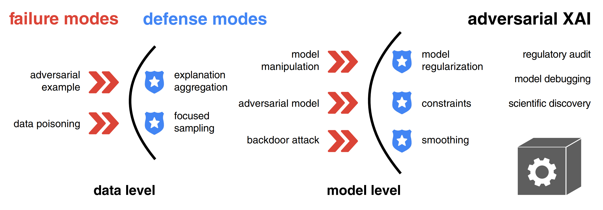

# Adversarial Attacks and Defenses in Explainable AI

A curated list of papers concerning adversarial explainable AI (AdvXAI). 

**Contributions and comments are welcomed!** Send a pull request to this repository or write me at [h.baniecki@uw.edu.pl](mailto:h.baniecki@uw.edu.pl)


### Survey

**September, 2023**: An extended version of the paper is available on arXiv: https://arxiv.org/abs/2306.06123v2

**June, 2023**: We summarized the current state of the AdvXAI field in the following survey paper (work in progress)

> H. Baniecki, P. Biecek.  **Adversarial Attacks and Defenses in Explainable Artificial Intelligence: A Survey**. *IJCAI Workshop on XAI*, 2023. https://arxiv.org/abs/2306.06123v1


### Abstract

<p align="center">
  <a href="https://arxiv.org/abs/2306.06123">
    
  </a>
</p> 

> Explainable artificial intelligence (XAI) methods are portrayed as a remedy for debugging and trusting statistical and deep learning models, as well as interpreting their predictions. However, recent advances in adversarial machine learning (AdvML) highlight the limitations and vulnerabilities of state-of-the-art explanation methods, putting their security and trustworthiness into question. The possibility of manipulating, fooling or fairwashing evidence of the model's reasoning has detrimental consequences when applied in high-stakes decision-making and knowledge discovery. This survey provides a comprehensive overview of research concerning adversarial attacks on explanations of machine learning models, as well as fairness metrics. We introduce a unified notation and taxonomy of methods facilitating a common ground for researchers and practitioners from the intersecting research fields of AdvML and XAI. We discuss how to defend against attacks and design robust interpretation methods. We contribute a list of existing insecurities in XAI and outline the emerging research directions in adversarial XAI (AdvXAI). Future work should address improving explanation methods and evaluation protocols to take into account the reported safety issues.


### Citation

```
@article{baniecki2023adversarial,
  author = {Hubert Baniecki and Przemyslaw Biecek},
  title   = {Adversarial Attacks and Defenses in Explainable 
             Artificial Intelligence: A Survey},
  journal = {arXiv preprint arXiv:2306.06123},
  year    = {2023}
}
```


## Related surveys

* [Explainable AI Methods - A Brief Overview](https://doi.org/10.1007/978-3-031-04083-2_2)
  <details>
  <summary> A. Holzinger et al.  
      <em>xxAI - Beyond Explainable AI</em>, 2020 </summary>
    Explainable Artificial Intelligence (xAI) is an established field with a vibrant community that has developed a variety of very successful approaches to explain and interpret predictions of complex machine learning models such as deep neural networks. In this article, we briefly introduce a few selected methods and discuss them in a short, clear and concise way. The goal of this article is to give beginners, especially application engineers and data scientists, a quick overview of the state of the art in this current topic. The following 17 methods are covered in this chapter: LIME, Anchors, GraphLIME, LRP, DTD, PDA, TCAV, XGNN, SHAP, ASV, Break-Down, Shapley Flow, Textual Explanations of Visual Models, Integrated Gradients, Causal Models, Meaningful Perturbations, and X-NeSyL.
  </details>
* [Adversarial Machine Learning Attacks and Defense Methods in the Cyber Security Domain](https://doi.org/10.1145/3453158)
  <details>
  <summary> I. Rosenberg et al.  
      <em>ACM Computing Surveys</em>, 2021 </summary>
    In recent years, machine learning algorithms, and more specifically deep learning algorithms, have been widely used in many fields, including cyber security. However, machine learning systems are vulnerable to adversarial attacks, and this limits the application of machine learning, especially in non-stationary, adversarial environments, such as the cyber security domain, where actual adversaries (e.g., malware developers) exist. This article comprehensively summarizes the latest research on adversarial attacks against security solutions based on machine learning techniques and illuminates the risks they pose. First, the adversarial attack methods are characterized based on their stage of occurrence, and the attacker’ s goals and capabilities. Then, we categorize the applications of adversarial attack and defense methods in the cyber security domain. Finally, we highlight some characteristics identified in recent research and discuss the impact of recent advancements in other adversarial learning domains on future research directions in the cyber security domain. To the best of our knowledge, this work is the first to discuss the unique challenges of implementing end-to-end adversarial attacks in the cyber security domain, map them in a unified taxonomy, and use the taxonomy to highlight future research directions.
  </details>
* [Adversarial Attacks and Defenses: An Interpretation Perspective](https://dl.acm.org/doi/10.1145/3468507.3468519)
  <details>
  <summary> N. Liu et al. 
      <em>ACM SIGKDD Explorations Newsletter</em>, 2021 </summary>
    Despite the recent advances in a wide spectrum of applications, machine learning models, especially deep neural networks, have been shown to be vulnerable to adversarial attacks. Attackers add carefully-crafted perturbations to input, where the perturbations are almost imperceptible to humans, but can cause models to make wrong predictions. Techniques to protect models against adversarial input are called adversarial defense methods. Although many approaches have been proposed to study adversarial attacks and defenses in different scenarios, an intriguing and crucial challenge remains that how to really understand model vulnerability? Inspired by the saying that "if you know yourself and your enemy, you need not fear the battles", we may tackle the challenge above after interpreting machine learning models to open the black-boxes. The goal of model interpretation, or interpretable machine learning, is to extract human-understandable terms for the working mechanism of models. Recently, some approaches start incorporating interpretation into the exploration of adversarial attacks and defenses. Meanwhile, we also observe that many existing methods of adversarial attacks and defenses, although not explicitly claimed, can be understood from the perspective of interpretation. In this paper, we review recent work on adversarial attacks and defenses, particularly from the perspective of machine learning interpretation. We categorize interpretation into two types, feature-level interpretation, and model-level interpretation. For each type of interpretation, we elaborate on how it could be used for adversarial attacks and defenses. We then briefly illustrate additional correlations between interpretation and adversaries. Finally, we discuss the challenges and future directions for tackling adversary issues with interpretation.
  </details>
* [A Survey on the Robustness of Feature Importance and Counterfactual Explanations](https://arxiv.org/abs/2111.00358)
  <details>
  <summary> S. Mishra et al.  
      <em>Workshop on Explainable AI in Finance (ICAIF XAI)</em>, 2021 </summary>
    There exist several methods that aim to address the crucial task of understanding the behaviour of AI/ML models. Arguably, the most popular among them are local explanations that focus on investigating model behaviour for individual instances. Several methods have been proposed for local analysis, but relatively lesser effort has gone into understanding if the explanations are robust and accurately reflect the behaviour of underlying models. In this work, we present a survey of the works that analysed the robustness of two classes of local explanations (feature importance and counterfactual explanations) that are popularly used in analysing AI/ML models in finance. The survey aims to unify existing definitions of robustness, introduces a taxonomy to classify different robustness approaches, and discusses some interesting results. Finally, the survey introduces some pointers about extending current robustness analysis approaches so as to identify reliable explainability methods.
  </details>
* [Adversarial Machine Learning in Image Classification: A Survey Toward the Defender’s Perspective](https://doi.org/10.1145/3485133)
  <details>
  <summary> G. R. Machado et al.  
      <em>ACM Computing Surveys</em>, 2022 </summary>
    Deep Learning algorithms have achieved state-of-the-art performance for Image Classification. For this reason, they have been used even in security-critical applications, such as biometric recognition systems and self-driving cars. However, recent works have shown those algorithms, which can even surpass human capabilities, are vulnerable to adversarial examples. In Computer Vision, adversarial examples are images containing subtle perturbations generated by malicious optimization algorithms to fool classifiers. As an attempt to mitigate these vulnerabilities, numerous countermeasures have been proposed recently in the literature. However, devising an efficient defense mechanism has proven to be a difficult task, since many approaches demonstrated to be ineffective against adaptive attackers. Thus, this article aims to provide all readerships with a review of the latest research progress on Adversarial Machine Learning in Image Classification, nevertheless, with a defender’s perspective. This article introduces novel taxonomies for categorizing adversarial attacks and defenses, as well as discuss possible reasons regarding the existence of adversarial examples. In addition, relevant guidance is also provided to assist researchers when devising and evaluating defenses. Finally, based on the reviewed literature, this article suggests some promising paths for future research.
  </details>
* [On the Robustness of Explanations of Deep Neural Network Models: A Survey](https://arxiv.org/abs/2211.04780)
  <details>
  <summary> A. Jyoti et al.  
      <em>arXiv preprint</em>, 2022 </summary>
    Explainability has been widely stated as a cornerstone of the responsible and trustworthy use of machine learning models. With the ubiquitous use of Deep Neural Network (DNN) models expanding to risk-sensitive and safety-critical domains, many methods have been proposed to explain the decisions of these models. Recent years have also seen concerted efforts that have shown how such explanations can be distorted (attacked) by minor input perturbations. While there have been many surveys that review explainability methods themselves, there has been no effort hitherto to assimilate the different methods and metrics proposed to study the robustness of explanations of DNN models. In this work, we present a comprehensive survey of methods that study, understand, attack, and defend explanations of DNN models. We also present a detailed review of different metrics used to evaluate explanation methods, as well as describe attributional attack and defense methods. We conclude with lessons and take-aways for the community towards ensuring robust explanations of DNN model predictions.
  </details>
* [A comprehensive taxonomy for explainable artificial intelligence: a systematic survey of surveys on methods and concepts](https://doi.org/10.1007/s10618-022-00867-8)
  <details>
  <summary> G. Schwalbe & B. Finzel.
      <em>Data Mining and Knowledge Discovery</em>, 2023 </summary>
    In the meantime, a wide variety of terminologies, motivations, approaches, and evaluation criteria have been developed within the research field of explainable artificial intelligence (XAI). With the amount of XAI methods vastly growing, a taxonomy of methods is needed by researchers as well as practitioners: To grasp the breadth of the topic, compare methods, and to select the right XAI method based on traits required by a specific use-case context. Many taxonomies for XAI methods of varying level of detail and depth can be found in the literature. While they often have a different focus, they also exhibit many points of overlap. This paper unifies these efforts and provides a complete taxonomy of XAI methods with respect to notions present in the current state of research. In a structured literature analysis and meta-study, we identified and reviewed more than 50 of the most cited and current surveys on XAI methods, metrics, and method traits. After summarizing them in a survey of surveys, we merge terminologies and concepts of the articles into a unified structured taxonomy. Single concepts therein are illustrated by more than 50 diverse selected example methods in total, which we categorize accordingly. The taxonomy may serve both beginners, researchers, and practitioners as a reference and wide-ranging overview of XAI method traits and aspects. Hence, it provides foundations for targeted, use-case-oriented, and context-sensitive future research.
  </details>
* [From Anecdotal Evidence to Quantitative Evaluation Methods: A Systematic Review on Evaluating Explainable AI](https://doi.org/10.1145/3583558)
  <details>
  <summary> M. Nauta et al.  
      <em>ACM Computing Surveys</em>, 2023 </summary>
    The rising popularity of explainable artificial intelligence (XAI) to understand high-performing black boxes raised the question of how to evaluate explanations of machine learning (ML) models. While interpretability and explainability are often presented as a subjectively validated binary property, we consider it a multi-faceted concept. We identify 12 conceptual properties, such as Compactness and Correctness, that should be evaluated for comprehensively assessing the quality of an explanation. Our so-called Co-12 properties serve as categorization scheme for systematically reviewing the evaluation practices of more than 300 papers published in the last 7 years at major AI and ML conferences that introduce an XAI method. We find that 1 in 3 papers evaluate exclusively with anecdotal evidence, and 1 in 5 papers evaluate with users. This survey also contributes to the call for objective, quantifiable evaluation methods by presenting an extensive overview of quantitative XAI evaluation methods. Our systematic collection of evaluation methods provides researchers and practitioners with concrete tools to thoroughly validate, benchmark and compare new and existing XAI methods. The Co-12 categorization scheme and our identified evaluation methods open up opportunities to include quantitative metrics as optimization criteria during model training in order to optimize for accuracy and interpretability simultaneously.
  </details>


## Background (2018)

* [Towards better understanding of gradient-based attribution methods for Deep Neural Networks](https://openreview.net/forum?id=Sy21R9JAW)
  <details>
  <summary> M. Ancona et al.
      <em>International Conference on Learning Representations (ICLR)</em>, 2018 </summary>
    Understanding the flow of information in Deep Neural Networks (DNNs) is a challenging problem that has gain increasing attention over the last few years. While several methods have been proposed to explain network predictions, there have been only a few attempts to compare them from a theoretical perspective. What is more, no exhaustive empirical comparison has been performed in the past. In this work we analyze four gradient-based attribution methods and formally prove conditions of equivalence and approximation between them. By reformulating two of these methods, we construct a unified framework which enables a direct comparison, as well as an easier implementation. Finally, we propose a novel evaluation metric, called Sensitivity-n and test the gradient-based attribution methods alongside with a simple perturbation-based attribution method on several datasets in the domains of image and text classification, using various network architectures.
  </details>
* [Towards Robust Interpretability with Self-Explaining Neural Networks](https://papers.nips.cc/paper/8003-towards-robust-interpretability-with-self-explaining-neural-networks#:~:text=paper)
  <details>
  <summary> D. Alvarez-Melis & T. Jaakkola. 
      <em>Neural Information Processing Systems (NeurIPS)</em>, 2018 </summary>
    Most recent work on interpretability of complex machine learning models has focused on estimating a-posteriori explanations for previously trained models around specific predictions. Self-explaining models where interpretability plays a key role already during learning have received much less attention. We propose three desiderata for explanations in general -- explicitness, faithfulness, and stability -- and show that existing methods do not satisfy them. In response, we design self-explaining models in stages, progressively generalizing linear classifiers to complex yet architecturally explicit models. Faithfulness and stability are enforced via regularization specifically tailored to such models. Experimental results across various benchmark datasets show that our framework offers a promising direction for reconciling model complexity and interpretability.
  </details>
* [Sanity Checks for Saliency Maps](https://papers.nips.cc/paper/8160-sanity-checks-for-saliency-maps#:~:text=pdf#:~:text=paper)
  <details>
  <summary> J. Adebayo et al. 
      <em>Neural Information Processing Systems (NeurIPS)</em>, 2018 </summary>
    Saliency methods have emerged as a popular tool to highlight features in an input deemed relevant for the prediction of a learned model. Several saliency methods have been proposed, often guided by visual appeal on image data. In this work, we propose an actionable methodology to evaluate what kinds of explanations a given method can and cannot provide. We find that reliance, solely, on visual assessment can be misleading. Through extensive experiments we show that some existing saliency methods are independent both of the model and of the data generating process. Consequently, methods that fail the proposed tests are inadequate for tasks that are sensitive to either data or model, such as, finding outliers in the data, explaining the relationship between inputs and outputs that the model learned, and debugging the model. We interpret our findings through an analogy with edge detection in images, a technique that requires neither training data nor model. Theory in the case of a linear model and a single-layer convolutional neural network supports our experimental findings.
  </details>


## Adversarial attacks on model explanations

* [Interpretation of Neural Networks Is Fragile](https://doi.org/10.1609/aaai.v33i01.33013681)
  <details>
  <summary> A. Ghorbani et al. 
      <em>AAAI Conference on Artificial Intelligence (AAAI)</em>, 2019 </summary>
    In order for machine learning to be trusted in many applications, it is critical to be able to reliably explain why the machine learning algorithm makes certain predictions. For this reason, a variety of methods have been developed recently to interpret neural network predictions by providing, for example, feature importance maps. For both scientific robustness and security reasons, it is important to know to what extent can the interpretations be altered by small systematic perturbations to the input data, which might be generated by adversaries or by measurement biases. In this paper, we demonstrate how to generate adversarial perturbations that produce perceptively indistinguishable inputs that are assigned the same predicted label, yet have very different interpretations. We systematically characterize the robustness of interpretations generated by several widely-used feature importance interpretation methods (feature importance maps, integrated gradients, and DeepLIFT) on ImageNet and CIFAR-10. In all cases, our experiments show that systematic perturbations can lead to dramatically different interpretations without changing the label. We extend these results to show that interpretations based on exemplars (e.g. influence functions) are similarly susceptible to adversarial attack. Our analysis of the geometry of the Hessian matrix gives insight on why robustness is a general challenge to current interpretation approaches.
  </details>
* [The (Un)reliability of Saliency Methods](https://www.researchgate.net/publication/335707891_The_Unreliability_of_Saliency_Methods#:~:text=Public)
  <details>
  <summary> P. J. Kindermans et al. 
      <em>Explainable AI: Interpreting, Explaining and Visualizing Deep Learning</em>, 2019 </summary>
    Saliency methods aim to explain the predictions of deep neural networks. These methods lack reliability when the explanation is sensitive to factors that do not contribute to the model prediction. We use a simple and common pre-processing step which can be compensated for easily—adding a constant shift to the input data—to show that a transformation with no effect on how the model makes the decision can cause numerous methods to attribute incorrectly. In order to guarantee reliability, we believe that the explanation should not change when we can guarantee that two networks process the images in identical manners. We show, through several examples, that saliency methods that do not satisfy this requirement result in misleading attribution. The approach can be seen as a type of unit test; we construct a narrow ground truth to measure one stated desirable property. As such, we hope the community will embrace the development of additional tests.
  </details>
* [How to Manipulate CNNs to Make Them Lie: the GradCAM Case](https://doi.org/10.48550/arXiv.1907.10901)
  <details>
  <summary> T. Viering et al. 
      <em>BMVC Workshop on Interpretable and Explainable Machine Vision (BMVC Workshop)</em>, 2019 </summary>
    Recently many methods have been introduced to explain CNN decisions. However, it has been shown that some methods can be sensitive to manipulation of the input. We continue this line of work and investigate the explanation method GradCAM. Instead of manipulating the input, we consider an adversary that manipulates the model itself to attack the explanation. By changing weights and architecture, we demonstrate that it is possible to generate any desired explanation, while leaving the model's accuracy essentially unchanged. This illustrates that GradCAM cannot explain the decision of every CNN and provides a proof of concept showing that it is possible to obfuscate the inner workings of a CNN. Finally, we combine input and model manipulation. To this end we put a backdoor in the network: the explanation is correct unless there is a specific pattern present in the input, which triggers a malicious explanation. Our work raises new security concerns, especially in settings where explanations of models may be used to make decisions, such as in the medical domain.
  </details>
* [Fooling Network Interpretation in Image Classification](https://doi.org/10.48550/arXiv.1812.02843)
  <details>
  <summary> A. Subramanya et al. 
      <em>IEEE/CVF International Conference on Computer Vision (ICCV)</em>, 2019 </summary>
    Deep neural networks have been shown to be fooled rather easily using adversarial attack algorithms. Practical methods such as adversarial patches have been shown to be extremely effective in causing misclassification. However, these patches are highlighted using standard network interpretation algorithms, thus revealing the identity of the adversary. We show that it is possible to create adversarial patches which not only fool the prediction, but also change what we interpret regarding the cause of the prediction. Moreover, we introduce our attack as a controlled setting to measure the accuracy of interpretation algorithms. We show this using extensive experiments for Grad-CAM interpretation that transfers to occluding patch interpretation as well. We believe our algorithms can facilitate developing more robust network interpretation tools that truly explain the network's underlying decision making process.
  </details>
* [Fooling Neural Network Interpretations via Adversarial Model Manipulation](https://papers.nips.cc/paper/8558-fooling-neural-network-interpretations-via-adversarial-model-manipulation#:~:text=paper)
  <details>
  <summary> J. Heo et al. 
      <em>Neural Information Processing Systems (NeurIPS)</em>, 2019 </summary>
    We ask whether the neural network interpretation methods can be fooled via adversarial model manipulation, which is defined as a model fine-tuning step that aims to radically alter the explanations without hurting the accuracy of the original models, e.g., VGG19, ResNet50, and DenseNet121. By incorporating the interpretation results directly in the penalty term of the objective function for fine-tuning, we show that the state-of-the-art saliency map based interpreters, e.g., LRP, Grad-CAM, and SimpleGrad, can be easily fooled with our model manipulation. We propose two types of fooling, Passive and Active, and demonstrate such foolings generalize well to the entire validation set as well as transfer to other interpretation methods. Our results are validated by both visually showing the fooled explanations and reporting quantitative metrics that measure the deviations from the original explanations. We claim that the stability of neural network interpretation method with respect to our adversarial model manipulation is an important criterion to check for developing robust and reliable neural network interpretation method.
  </details>
* [Explanations can be manipulated and geometry is to blame](https://papers.nips.cc/paper/9511-explanations-can-be-manipulated-and-geometry-is-to-blame)
  <details open>
  <summary> A. K. Dombrowski et al. 
      <em>Neural Information Processing Systems (NeurIPS)</em>, 2019 </summary>
    Explanation methods aim to make neural networks more trustworthy and interpretable. In this paper, we demonstrate a property of explanation methods which is disconcerting for both of these purposes. Namely, we show that explanations can be manipulated arbitrarily by applying visually hardly perceptible perturbations to the input that keep the network's output approximately constant. We establish theoretically that this phenomenon can be related to certain geometrical properties of neural networks. This allows us to derive an upper bound on the susceptibility of explanations to manipulations. Based on this result, we propose effective mechanisms to enhance the robustness of explanations.
  </details>
  <p align="center"><a href="https://papers.nips.cc/paper/9511-explanations-can-be-manipulated-and-geometry-is-to-blame"></a></p>
* [You Shouldn't Trust Me: Learning Models Which Conceal Unfairness From Multiple Explanation Methods](https://ecai2020.eu/papers/72_paper.pdf)
  <details>
  <summary> B. Dimanov et al. 
      <em>European Conference on Artificial Intelligence (ECAI)</em>, 2020 </summary>
    Transparency of algorithmic systems has been discussed as a way for end-users and regulators to develop appropriate trust in machine learning models. One popular approach, LIME [26], even suggests that model explanations can answer the question “Why should I trust you?” Here we show a straightforward method for modifying a pre-trained model to manipulate the output of many popular feature importance explanation methods with little change in accuracy, thus demonstrating the danger of trusting such explanation methods. We show how this explanation attack can mask a model’s discriminatory use of a sensitive feature, raising strong concerns about using such explanation methods to check model fairness.
  </details>
* [Fooling LIME and SHAP: Adversarial Attacks on Post hoc Explanation Methods](https://dl.acm.org/doi/10.1145/3375627.3375830#:~:text=pdf)
  <details open>
  <summary> D. Slack et al. 
      <em>AAAI/ACM Conference on AI, Ethics, and Society (AIES)</em>, 2020 </summary>
    As machine learning black boxes are increasingly being deployed in domains such as healthcare and criminal justice, there is growing emphasis on building tools and techniques for explaining these black boxes in an interpretable manner. Such explanations are being leveraged by domain experts to diagnose systematic errors and underlying biases of black boxes. In this paper, we demonstrate that post hoc explanations techniques that rely on input perturbations, such as LIME and SHAP, are not reliable. Specifically, we propose a novel scaffolding technique that effectively hides the biases of any given classifier by allowing an adversarial entity to craft an arbitrary desired explanation. Our approach can be used to scaffold any biased classifier in such a way that its predictions on the input data distribution still remain biased, but the post hoc explanations of the scaffolded classifier look innocuous. Using extensive evaluation with multiple real world datasets (including COMPAS), we demonstrate how extremely biased (racist) classifiers crafted by our framework can easily fool popular explanation techniques such as LIME and SHAP into generating innocuous explanations which do not reflect the underlying biases.
  </details>
    <p align="center"><a href="https://dl.acm.org/doi/10.1145/3375627.3375830"></a></p>
* ["How do I fool you?": Manipulating User Trust via Misleading Black Box Explanations](https://dl.acm.org/doi/10.1145/3375627.3375833#:~:text=pdf)
  <details>
  <summary> H. Lakkaraju & O. Bastani. 
      <em>AAAI/ACM Conference on AI, Ethics, and Society (AIES)</em>, 2020 </summary>
    As machine learning black boxes are increasingly being deployed in critical domains such as healthcare and criminal justice, there has been a growing emphasis on developing techniques for explaining these black boxes in a human interpretable manner. There has been recent concern that a high-fidelity explanation of a black box ML model may not accurately reflect the biases in the black box. As a consequence, explanations have the potential to mislead human users into trusting a problematic black box. In this work, we rigorously explore the notion of misleading explanations and how they influence user trust in black box models. Specifically, we propose a novel theoretical framework for understanding and generating misleading explanations, and carry out a user study with domain experts to demonstrate how these explanations can be used to mislead users. Our work is the first to empirically establish how user trust in black box models can be manipulated via misleading explanations.
  </details>
* [Fairwashing Explanations with Off-Manifold Detergent](https://proceedings.mlr.press/v119/anders20a#:~:text=download%20pdf)
  <details>
  <summary> C. J. Anders et al. 
      <em>International Conference on Machine Learning (ICML)</em>, 2020 </summary>
    Explanation methods promise to make black-box classifiers more transparent. As a result, it is hoped that they can act as proof for a sensible, fair and trustworthy decision-making process of the algorithm and thereby increase its acceptance by the end-users. In this paper, we show both theoretically and experimentally that these hopes are presently unfounded. Specifically, we show that, for any classifier g, one can always construct another classifier g' which has the same behavior on the data (same train, validation, and test error) but has arbitrarily manipulated explanation maps. We derive this statement theoretically using differential geometry and demonstrate it experimentally for various explanation methods, architectures, and datasets. Motivated by our theoretical insights, we then propose a modification of existing explanation methods which makes them significantly more robust.
  </details>
* [Black Box Attacks on Explainable Artificial Intelligence(XAI) methods in Cyber Security](https://ieeexplore.ieee.org/abstract/document/9206780)
  <details>
  <summary> A. Kuppa & N. A. Le-Khac. 
      <em>International Joint Conference on Neural Networks (IJCNN)</em>, 2020 </summary>
    Cybersecurity community is slowly leveraging Machine Learning (ML) to combat ever evolving threats. One of the biggest drivers for successful adoption of these models is how well domain experts and users are able to understand and trust their functionality. As these black-box models are being employed to make important predictions, the demand for transparency and explainability is increasing from the stakeholders. Explanations supporting the output of ML models are crucial in cyber security, where experts require far more information from the model than a simple binary output for their analysis. Recent approaches in the literature have focused on three different areas: (a) creating and improving explainability methods which help users better understand the internal workings of ML models and their outputs; (b) attacks on interpreters in white box setting; (c) defining the exact properties and metrics of the explanations generated by models. However, they have not covered, the security properties and threat models relevant to cybersecurity domain, and attacks on explainable models in black box settings. In this paper, we bridge this gap by proposing a taxonomy for Explainable Artificial Intelligence (XAI) methods, covering various security properties and threat models relevant to cyber security domain. We design a novel black box attack for analyzing the consistency, correctness and confidence security properties of gradient based XAI methods. We validate our proposed system on 3 security-relevant data-sets and models, and demonstrate that the method achieves attacker's goal of misleading both the classifier and explanation report and, only explainability method without affecting the classifier output. Our evaluation of the proposed approach shows promising results and can help in designing secure and robust XAI methods.
  </details>  
* [Interpretable Deep Learning under Fire](https://www.usenix.org/conference/usenixsecurity20/presentation/zhang-xinyang#:~:text=pdf)
  <details>
  <summary> X. Zhang et al. 
      <em>USENIX Security Symposium</em>, 2020 </summary>
    Providing explanations for deep neural network (DNN) models is crucial for their use in security-sensitive domains. A plethora of interpretation models have been proposed to help users understand the inner workings of DNNs: how does a DNN arrive at a specific decision for a given input? The improved interpretability is believed to offer a sense of security by involving human in the decision-making process. Yet, due to its data-driven nature, the interpretability itself is potentially susceptible to malicious manipulations, about which little is known thus far. Here we bridge this gap by conducting the first systematic study on the security of interpretable deep learning systems (IDLSes). We show that existing IDLSes are highly vulnerable to adversarial manipulations. Specifically, we present ADV2, a new class of attacks that generate adversarial inputs not only misleading target DNNs but also deceiving their coupled interpretation models. Through empirical evaluation against four major types of IDLSes on benchmark datasets and in security-critical applications (e.g., skin cancer diagnosis), we demonstrate that with ADV2 the adversary is able to arbitrarily designate an input's prediction and interpretation. Further, with both analytical and empirical evidence, we identify the prediction-interpretation gap as one root cause of this vulnerability -- a DNN and its interpretation model are often misaligned, resulting in the possibility of exploiting both models simultaneously. Finally, we explore potential countermeasures against ADV2, including leveraging its low transferability and incorporating it in an adversarial training framework. Our findings shed light on designing and operating IDLSes in a more secure and informative fashion, leading to several promising research directions.
  </details>
* [Remote explainability faces the bouncer problem](https://www.nature.com/articles/s42256-020-0216-z)
  <details>
  <summary> E. Le Merrer & G. Tredan. 
      <em>Nature Machine Intelligence</em>, 2020 </summary>
    The concept of explainability is envisioned to satisfy society’s demands for transparency about machine learning decisions. The concept is simple: like humans, algorithms should explain the rationale behind their decisions so that their fairness can be assessed. Although this approach is promising in a local context (for example, the model creator explains it during debugging at the time of training), we argue that this reasoning cannot simply be transposed to a remote context, where a model trained by a service provider is only accessible to a user through a network and its application programming interface. This is problematic, as it constitutes precisely the target use case requiring transparency from a societal perspective. Through an analogy with a club bouncer (who may provide untruthful explanations upon customer rejection), we show that providing explanations cannot prevent a remote service from lying about the true reasons leading to its decisions. More precisely, we observe the impossibility of remote explainability for single explanations by constructing an attack on explanations that hides discriminatory features from the querying user. We provide an example implementation of this attack. We then show that the probability that an observer spots the attack, using several explanations for attempting to find incoherences, is low in practical settings. This undermines the very concept of remote explainability in general.
  </details>
* [On the Privacy Risks of Model Explanations](https://www.comp.nus.edu.sg/~reza/files/Shokri-AIES2021.pdf)
  <details>
  <summary> R. Shokri et al. 
      <em>AAAI/ACM Conference on AI, Ethics, and Society (AIES)</em>, 2021 </summary>
    Privacy and transparency are two key foundations of trustworthy machine learning. Model explanations offer insights into a model’s decisions on input data, whereas privacy is primarily concerned with protecting information about the training data. We analyze connections between model explanations and the leakage of sensitive information about the model’s training set. We investigate the privacy risks of feature-based model explanations using membership inference attacks: quantifying how much model predictions plus their explanations leak information about the presence of a datapoint in the training set of a model. We extensively evaluate membership inference attacks based on feature-based model explanations, over a variety of datasets. We show that backpropagation-based explanations can leak a significant amount of information about individual training datapoints. This is because they reveal statistical information about the decision boundaries of the model about an input, which can reveal its membership. We also empirically investigate the trade-off between privacy and explanation quality, by studying the perturbation-based model explanations.
  </details>
* [Perturbing Inputs for Fragile Interpretations in Deep Natural Language Processing](https://arxiv.org/abs/2108.04990)
  <details>
  <summary> S. Sinha et al. 
      <em>Workshop on Analyzing and Interpreting Neural Networks for NLP (EMNLP BlackboxNLP)</em>, 2021 </summary>
    Interpretability methods like Integrated Gradient and LIME are popular choices for explaining natural language model predictions with relative word importance scores. These interpretations need to be robust for trustworthy NLP applications in high-stake areas like medicine or finance. Our paper demonstrates how interpretations can be manipulated by making simple word perturbations on an input text. Via a small portion of word-level swaps, these adversarial perturbations aim to make the resulting text semantically and spatially similar to its seed input (therefore sharing similar interpretations). Simultaneously, the generated examples achieve the same prediction label as the seed yet are given a substantially different explanation by the interpretation methods. Our experiments generate fragile interpretations to attack two SOTA interpretation methods, across three popular Transformer models and on two different NLP datasets. We observe that the rank order correlation drops by over 20% when less than 10% of words are perturbed on average. Further, rank-order correlation keeps decreasing as more words get perturbed. Furthermore, we demonstrate that candidates generated from our method have good quality metrics. Our code is available at: https://github.com/QData/TextAttack-Fragile-Interpretations.
  </details>
* [Data Poisoning Attacks Against Outcome Interpretations of Predictive Models](https://doi.org/10.1145/3447548.3467405)
  <details>
  <summary> H. Zhang et al. 
      <em>ACM SIGKDD Conference on Knowledge Discovery and Data Mining (KDD)</em>, 2021 </summary>
    The past decades have witnessed significant progress towards improving the accuracy of predictions powered by complex machine learning models. Despite much success, the lack of model interpretability prevents the usage of these techniques in life-critical systems such as medical diagnosis and self-driving systems. Recently, the interpretability issue has received much attention, and one critical task is to explain why a predictive model makes a specific decision. We refer to this task as outcome interpretation. Many outcome interpretation methods have been developed to produce human-understandable interpretations by utilizing intermediate results of the machine learning models, such as gradients and model parameters. Although the effectiveness of outcome interpretation approaches has been shown in a benign environment, their robustness against data poisoning attacks (i.e., attacks at the training phase) has not been studied. As the first work towards this direction, we aim to answer an important question: Can training-phase adversarial samples manipulate the outcome interpretation of target samples? To answer this question, we propose a data poisoning attack framework named IMF (Interpretation Manipulation Framework), which can manipulate the interpretations of target samples produced by representative outcome interpretation methods. Extensive evaluations verify the effectiveness and efficiency of the proposed attack strategies on two real-world datasets.
  </details>
* [Counterfactual Explanations Can Be Manipulated](https://openreview.net/forum?id=iaO_IH7CnGJ)
  <details>
  <summary> D. Slack et al. 
      <em>Neural Information Processing Systems (NeurIPS)</em>, 2021 </summary>
    Counterfactual explanations are emerging as an attractive option for providing recourse to individuals adversely impacted by algorithmic decisions. As they are deployed in critical applications (e.g law enforcement, financial lending), it becomes important to ensure that we clearly understand the vulnerabilties of these methods and find ways to address them. However, there is little understanding of the vulnerabilities and shortcomings of counterfactual explanations. In this work, we introduce the first framework that describes the vulnerabilities of counterfactual explanations and shows how they can be manipulated. More specifically, we show counterfactual explanations may converge to drastically different counterfactuals under a small perturbation indicating they are not robust. Leveraging this insight, we introduce a novel objective to train seemingly fair models where counterfactual explanations find much lower cost recourse under a slight perturbation. We describe how these models can unfairly provide low-cost recourse for specific subgroups in the data while appearing fair to auditors. We perform experiments on loan and violent crime prediction data sets where certain subgroups achieve up to 20x lower cost recourse under the perturbation. These results raise concerns regarding the dependability of current counterfactual explanation techniques, which we hope will inspire investigations in robust counterfactual explanations.
  </details>
* [Manipulating SHAP via Adversarial Data Perturbations (Student Abstract)](https://doi.org/10.1609/aaai.v36i11.21590)
  <details>
  <summary> H. Baniecki & P. Biecek. 
      <em>AAAI Conference on Artificial Intelligence (AAAI)</em>, 2022 </summary>
    We introduce a model-agnostic algorithm for manipulating SHapley Additive exPlanations (SHAP) with perturbation of tabular data. It is evaluated on predictive tasks from healthcare and financial domains to illustrate how crucial is the context of data distribution in interpreting machine learning models. Our method supports checking the stability of the explanations used by various stakeholders apparent in the domain of responsible AI; moreover, the result highlights the explanations’ vulnerability that can be exploited by an adversary.
  </details>
* [Making Corgis Important for Honeycomb Classification: Adversarial Attacks on Concept-based Explainability](https://arxiv.org/abs/2110.07120v2)
  <details>
  <summary> D. Brown & H. Kvinge 
      <em>Workshop on New Frontiers in Adversarial Machine Learning (ICML AdvML Frontiers)</em>, 2022 </summary>
    Methods for model explainability have become increasingly critical for testing the fairness and soundness of deep learning. Concept-based interpretability techniques, which use a small set of human-interpretable concept exemplars in order to measure the influence of a concept on a model's internal representation of input, are an important thread in this line of research. In this work we show that these explainability methods can suffer the same vulnerability to adversarial attacks as the models they are meant to analyze. We demonstrate this phenomenon on two well-known concept-based interpretability methods: TCAV and faceted feature visualization. We show that by carefully perturbing the examples of the concept that is being investigated, we can radically change the output of the interpretability method. The attacks that we propose can either induce positive interpretations (polka dots are an important concept for a model when classifying zebras) or negative interpretations (stripes are not an important factor in identifying images of a zebra). Our work highlights the fact that in safety-critical applications, there is need for security around not only the machine learning pipeline but also the model interpretation process.
  </details>
* [Fooling Partial Dependence via Data Poisoning](https://doi.org/10.1007/978-3-031-26409-2_8)
  <details>
  <summary> H. Baniecki et al. 
      <em>European Conference on Machine Learning and PKDD (ECML PKDD)</em>, 2022 </summary>
    Many methods have been developed to understand complex predictive models and high expectations are placed on post-hoc model explainability. It turns out that such explanations are not robust nor trustworthy, and they can be fooled. This paper presents techniques for attacking Partial Dependence (plots, profiles, PDP), which are among the most popular methods of explaining any predictive model trained on tabular data. We showcase that PD can be manipulated in an adversarial manner, which is alarming, especially in financial or medical applications where auditability became a must-have trait supporting black-box models. The fooling is performed via poisoning the data to bend and shift explanations in the desired direction using genetic and gradient algorithms. To the best of our knowledge, this is the first work using a genetic algorithm for attacking explanations, which is highly transferable as it generalizes both ways: in a model-agnostic and an explanation-agnostic manner.
  </details>
* [On the Privacy Risks of Algorithmic Recourse](https://proceedings.mlr.press/v206/pawelczyk23a)
  <details>
  <summary> M. Pawelczyk et al.
      <em>International Conference on Artificial Intelligence and Statistics (AISTATS)</em>, 2023 </summary>
    As predictive models are increasingly being employed to make consequential decisions, there is a growing emphasis on developing techniques that can provide algorithmic recourse to affected individuals. While such recourses can be immensely beneficial to affected individuals, potential adversaries could also exploit these recourses to compromise privacy. In this work, we make the first attempt at investigating if and how an adversary can leverage recourses to infer private information about the underlying model’s training data. To this end, we propose a series of novel membership inference attacks which leverage algorithmic recourse. More specifically, we extend the prior literature on membership inference attacks to the recourse setting by leveraging the distances between data instances and their corresponding counterfactuals output by state-of-the-art recourse methods. Extensive experimentation with real world and synthetic datasets demonstrates significant privacy leakage through recourses. Our work establishes unintended privacy leakage as an important risk in the widespread adoption of recourse methods.
  </details> 
* [Fooling SHAP with Stealthily Biased Sampling](https://openreview.net/forum?id=J4mJjotSauh)
  <details>
  <summary> G. Laberge et al.
      <em>International Conference on Learning Representations (ICLR)</em>, 2023 </summary>
    SHAP explanations aim at identifying which features contribute the most to the difference in model prediction at a specific input versus a background distribution. Recent studies have shown that they can be manipulated by malicious adversaries to produce arbitrary desired explanations. However, existing attacks focus solely on altering the black-box model itself. In this paper, we propose a complementary family of attacks that leave the model intact and manipulate SHAP explanations using stealthily biased sampling of the data points used to approximate expectations w.r.t the background distribution. In the context of fairness audit, we show that our attack can reduce the importance of a sensitive feature when explaining the difference in outcomes between groups while remaining undetected. These results highlight the manipulability of SHAP explanations and encourage auditors to treat them with skepticism.
  </details> 
* [Disguising Attacks with Explanation-Aware Backdoors](https://www.computer.org/csdl/proceedings-article/sp/2023/933600a996/1Js0DygrC36)
  <details>
  <summary> M. Noppel et al. 
      <em>IEEE Symposium on Security and Privacy (S&P)</em>, 2023 </summary>
    Explainable machine learning holds great potential for analyzing and understanding learning-based systems. These methods can, however, be manipulated to present unfaithful explanations, giving rise to powerful and stealthy adversaries. In this paper, we demonstrate how to fully disguise the adversarial operation of a machine learning model. Similar to neural backdoors, we modify the model’s prediction upon trigger presence but simultaneously fool an explanation method that is applied post-hoc for analysis. This enables an adversary to hide the presence of the trigger or point the explanation to entirely different portions of the input, throwing a red herring. We analyze different manifestations of these explanation-aware backdoors for gradient- and propagation-based explanation methods in the image domain, before we resume to conduct a red-herring attack against malware classification.
  </details>
* [SAFARI: Versatile and Efficient Evaluations for Robustness of Interpretability](https://doi.org/10.48550/arXiv.2208.09418)
  <details>
  <summary> W. Huang et al. 
      <em>IEEE/CVF International Conference on Computer Vision (ICCV)</em>, 2023 </summary>
    Interpretability of Deep Learning (DL) is a barrier to trustworthy AI. Despite great efforts made by the Explainable AI (XAI) community, explanations lack robustness -- indistinguishable input perturbations may lead to different XAI results. Thus, it is vital to assess how robust DL interpretability is, given an XAI method. In this paper, we identify several challenges that the state-of-the-art is unable to cope with collectively: i) existing metrics are not comprehensive; ii) XAI techniques are highly heterogeneous; iii) misinterpretations are normally rare events. To tackle these challenges, we introduce two black-box evaluation methods, concerning the worst-case interpretation discrepancy and a probabilistic notion of how robust in general, respectively. Genetic Algorithm (GA) with bespoke fitness function is used to solve constrained optimisation for efficient worst-case evaluation. Subset Simulation (SS), dedicated to estimate rare event probabilities, is used for evaluating overall robustness. Experiments show that the accuracy, sensitivity, and efficiency of our methods outperform the state-of-the-arts. Finally, we demonstrate two applications of our methods: ranking robust XAI methods and selecting training schemes to improve both classification and interpretation robustness.
  </details>


## Defense against the attacks on explanations

* [Adversarial explanations for understanding image classification decisions and improved NN robustness](https://arxiv.org/abs/1906.02896#:~:text=pdf)
  <details>
  <summary> W. Woods et al. 
      <em>Nature Machine Intelligence</em>, 2019 </summary>
    For sensitive problems, such as medical imaging or fraud detection, Neural Network (NN) adoption has been slow due to concerns about their reliability, leading to a number of algorithms for explaining their decisions. NNs have also been found vulnerable to a class of imperceptible attacks, called adversarial examples, which arbitrarily alter the output of the network. Here we demonstrate both that these attacks can invalidate prior attempts to explain the decisions of NNs, and that with very robust networks, the attacks themselves may be leveraged as explanations with greater fidelity to the model. We show that the introduction of a novel regularization technique inspired by the Lipschitz constraint, alongside other proposed improvements, greatly improves an NN's resistance to adversarial examples. On the ImageNet classification task, we demonstrate a network with an Accuracy-Robustness Area (ARA) of 0.0053, an ARA 2.4x greater than the previous state of the art. Improving the mechanisms by which NN decisions are understood is an important direction for both establishing trust in sensitive domains and learning more about the stimuli to which NNs respond.
  </details>
* [Robust Attribution Regularization](https://papers.nips.cc/paper/2019/hash/172ef5a94b4dd0aa120c6878fc29f70c-Abstract.html#:~:text=paper)
  <details>
  <summary> J. Chen et al. 
      <em>Neural Information Processing Systems (NeurIPS)</em>, 2019 </summary>
    An emerging problem in trustworthy machine learning is to train models that produce robust interpretations for their predictions. We take a step towards solving this problem through the lens of axiomatic attribution of neural networks. Our theory is grounded in the recent work, Integrated Gradients (IG) [STY17], in axiomatically attributing a neural network’s output change to its input change. We propose training objectives in classic robust optimization models to achieve robust IG attributions. Our objectives give principled generalizations of previous objectives designed for robust predictions, and they naturally degenerate to classic soft-margin training for one-layer neural networks. We also generalize previous theory and prove that the objectives for different robust optimization models are closely related. Experiments demonstrate the effectiveness of our method, and also point to intriguing problems which hint at the need for better optimization techniques or better neural network architectures for robust attribution training.
  </details>
* [A simple defense against adversarial attacks on heatmap explanations](https://arxiv.org/abs/2007.06381#:~:text=pdf)
  <details open>
  <summary> L. Rieger & L. K. Hansen. 
      <em>Workshop on Human Interpretability in Machine Learning (ICML WHI)</em>, 2020 </summary>
    With machine learning models being used for more sensitive applications, we rely on interpretability methods to prove that no discriminating attributes were used for classification. A potential concern is the so-called "fair-washing" - manipulating a model such that the features used in reality are hidden and more innocuous features are shown to be important instead. In our work we present an effective defence against such adversarial attacks on neural networks. By a simple aggregation of multiple explanation methods, the network becomes robust against manipulation. This holds even when the attacker has exact knowledge of the model weights and the explanation methods used.
  </details>
  <p align="center"><a href="https://arxiv.org/abs/2007.06381"></a></p>
* [Proper Network Interpretability Helps Adversarial Robustness in Classification](https://proceedings.mlr.press/v119/boopathy20a#:~:text=download%20pdf)
  <details>
  <summary> A. Boopathy et al. 
      <em>International Conference on Machine Learning (ICML)</em>, 2020 </summary>
    Recent works have empirically shown that there exist adversarial examples that can be hidden from neural network interpretability (namely, making network interpretation maps visually similar), or interpretability is itself susceptible to adversarial attacks. In this paper, we theoretically show that with a proper measurement of interpretation, it is actually difficult to prevent prediction-evasion adversarial attacks from causing interpretation discrepancy, as confirmed by experiments on MNIST, CIFAR-10 and Restricted ImageNet. Spurred by that, we develop an interpretability-aware defensive scheme built only on promoting robust interpretation (without the need for resorting to adversarial loss minimization). We show that our defense achieves both robust classification and robust interpretation, outperforming state-of-theart adversarial training methods against attacks of large perturbation in particular.
  </details>
* [Robust and Stable Black Box Explanations](https://proceedings.mlr.press/v119/lakkaraju20a#:~:text=download%20pdf)
  <details>
  <summary> H. Lakkaraju et al. 
      <em>International Conference on Machine Learning (ICML)</em>, 2020 </summary>
    As machine learning black boxes are increasingly being deployed in real-world applications, there has been a growing interest in developing post hoc explanations that summarize the behaviors of these black boxes. However, existing algorithms for generating such explanations have been shown to lack stability and robustness to distribution shifts. We propose a novel framework for generating robust and stable explanations of black box models based on adversarial training. Our framework optimizes a minimax objective that aims to construct the highest fidelity explanation with respect to the worst-case over a set of adversarial perturbations. We instantiate this algorithm for explanations in the form of linear models and decision sets by devising the required optimization procedures. To the best of our knowledge, this work makes the first attempt at generating post hoc explanations that are robust to a general class of adversarial perturbations that are of practical interest. Experimental evaluation with real-world and synthetic datasets demonstrates that our approach substantially improves robustness of explanations without sacrificing their fidelity on the original data distribution.
  </details>
* [Smoothed Geometry for Robust Attribution](https://proceedings.neurips.cc/paper/2020/hash/9d94c8981a48d12adfeecfe1ae6e0ec1-Abstract.html#:~:text=paper)
  <details>
  <summary> Z. Wang et al. 
      <em>Neural Information Processing Systems (NeurIPS)</em>, 2020 </summary>
    Feature attributions are a popular tool for explaining the behavior of Deep Neural Networks (DNNs), but have recently been shown to be vulnerable to attacks that produce divergent explanations for nearby inputs. This lack of robustness is especially problematic in high-stakes applications where adversarially-manipulated explanations could impair safety and trustworthiness. Building on a geometric understanding of these attacks presented in recent work, we identify Lipschitz continuity conditions on models' gradient that lead to robust gradient-based attributions, and observe that smoothness may also be related to the ability of an attack to transfer across multiple attribution methods. To mitigate these attacks in practice, we propose an inexpensive regularization method that promotes these conditions in DNNs, as well as a stochastic smoothing technique that does not require re-training. Our experiments on a range of image models demonstrate that both of these mitigations consistently improve attribution robustness, and confirm the role that smooth geometry plays in these attacks on real, large-scale models.
  </details>
* [On Guaranteed Optimal Robust Explanations for NLP Models](https://www.ijcai.org/proceedings/2021/366)
  <details>
  <summary> E. La Malfa et al. 
      <em>International Joint Conference on Artificial Intelligence (IJCAI)</em>, 2021</summary>
    We build on abduction-based explanations for machine learning and develop a method for computing local explanations for neural network models in natural language processing (NLP). Our explanations comprise a subset of the words of the input text that satisfies two key features: optimality w.r.t. a user-defined cost function, such as the length of explanation, and robustness, in that they ensure prediction invariance for any bounded perturbation in the embedding space of the left-out words. We present two solution algorithms, respectively based on implicit hitting sets and maximum universal subsets, introducing a number of algorithmic improvements to speed up convergence of hard instances. We show how our method can be configured with different perturbation sets in the embedded space and used to detect bias in predictions by enforcing include/exclude constraints on biased terms, as well as to enhance existing heuristic-based NLP explanation frameworks such as Anchors. We evaluate our framework on three widely used sentiment analysis tasks and texts of up to 100 words from SST, Twitter and IMDB datasets, demonstrating the effectiveness of the derived explanations.
  </details>
* [On Locality of Local Explanation Models](https://openreview.net/forum?id=6OkPFFMgBt)
  <details>
  <summary> S. Ghalebikesabi al. 
      <em>Neural Information Processing Systems (NeurIPS)</em>, 2021 </summary>
    Shapley values provide model agnostic feature attributions for model outcome at a particular instance by simulating feature absence under a global population distribution. The use of a global population can lead to potentially misleading results when local model behaviour is of interest. Hence we consider the formulation of  neighbourhood reference distributions that improve the local interpretability of Shapley values. By doing so, we find that the Nadaraya-Watson estimator, a well-studied kernel regressor, can be expressed as a self-normalised importance sampling estimator. Empirically, we observe that Neighbourhood Shapley values identify meaningful sparse  feature relevance attributions that provide insight into local model behaviour, complimenting conventional Shapley analysis. They also increase on-manifold explainability and robustness to the construction of adversarial classifiers. 
  </details>
* [Towards robust explanations for deep neural networks](https://doi.org/10.1016/j.patcog.2021.108194)
  <details>
  <summary> A. K. Dombrowski et al. 
      <em>Pattern Recognition</em>, 2022 </summary>
    Explanation methods shed light on the decision process of black-box classifiers such as deep neural networks. But their usefulness can be compromised because they are susceptible to manipulations. With this work, we aim to enhance the resilience of explanations. We develop a unified theoretical framework for deriving bounds on the maximal manipulability of a model. Based on these theoretical insights, we present three different techniques to boost robustness against manipulation: training with weight decay, smoothing activation functions, and minimizing the Hessian of the network. Our experimental results confirm the effectiveness of these approaches.
  </details>
* [Deceptive AI Explanations: Creation and Detection](https://arxiv.org/abs/2001.07641v3)
  <details>
  <summary> J. Schneider et al.
      <em>International Conference on Agents and Artificial Intelligence (ICAART)</em>, 2022 </summary>
    Artificial intelligence (AI) comes with great opportunities but can also pose significant risks. Automatically generated explanations for decisions can increase transparency and foster trust, especially for systems based on automated predictions by AI models. However, given, e.g., economic incentives to create dishonest AI, to what extent can we trust explanations? To address this issue, our work investigates how AI models (i.e., deep learning, and existing instruments to increase transparency regarding AI decisions) can be used to create and detect deceptive explanations. As an empirical evaluation, we focus on text classification and alter the explanations generated by GradCAM, a well-established explanation technique in neural networks. Then, we evaluate the effect of deceptive explanations on users in an experiment with 200 participants. Our findings confirm that deceptive explanations can indeed fool humans. However, one can deploy machine learning (ML) methods to detect seemingly minor deception attempts with accuracy exceeding 80% given sufficient domain knowledge. Without domain knowledge, one can still infer inconsistencies in the explanations in an unsupervised manner, given basic knowledge of the predictive model under scrutiny.
  </details>
* [Defense Against Explanation Manipulation](https://doi.org/10.3389/fdata.2022.704203)
  <details>
  <summary> R. Tang et al. 
      <em>Frontiers in Big Data</em>, 2022 </summary>
    Explainable machine learning attracts increasing attention as it improves the transparency of models, which is helpful for machine learning to be trusted in real applications. However, explanation methods have recently been demonstrated to be vulnerable to manipulation, where we can easily change a model's explanation while keeping its prediction constant. To tackle this problem, some efforts have been paid to use more stable explanation methods or to change model configurations. In this work, we tackle the problem from the training perspective, and propose a new training scheme called Adversarial Training on EXplanations (ATEX) to improve the internal explanation stability of a model regardless of the specific explanation method being applied. Instead of directly specifying explanation values over data instances, ATEX only puts constraints on model predictions which avoids involving second-order derivatives in optimization. As a further discussion, we also find that explanation stability is closely related to another property of the model, i.e., the risk of being exposed to adversarial attack. Through experiments, besides showing that ATEX improves model robustness against manipulation targeting explanation, it also brings additional benefits including smoothing explanations and improving the efficacy of adversarial training if applied to the model.
  </details>
* [Constraint-Driven Explanations for Black-Box ML Models](https://doi.org/10.1609/aaai.v36i8.20805)
  <details>
  <summary> A. A. Shrotri et al.
      <em>AAAI Conference on Artificial Intelligence (AAAI)</em>, 2022 </summary>
    The need to understand the inner workings of opaque Machine Learning models has prompted researchers to devise various types of post-hoc explanations. A large class of such explainers proceed in two phases: first perturb an input instance whose explanation is sought, and then generate an interpretable artifact to explain the prediction of the opaque model on that instance. Recently, Deutch and Frost proposed to use an additional input from the user: a set of constraints over the input space to guide the perturbation phase. While this approach affords the user the ability to tailor the explanation to their needs, striking a balance between flexibility, theoretical rigor and computational cost has remained an open challenge. We propose a novel constraint-driven explanation generation approach which simultaneously addresses these issues in a modular fashion. Our framework supports the use of expressive Boolean constraints giving the user more flexibility to specify the subspace to generate perturbations from. Leveraging advances in Formal Methods, we can theoretically guarantee strict adherence of the samples to the desired distribution. This also allows us to compute fidelity in a rigorous way, while scaling much better in practice. Our empirical study demonstrates concrete uses of our tool CLIME in obtaining more meaningful explanations with high fidelity.
  </details>
* ["Is your explanation stable?": A Robustness Evaluation Framework for Feature Attribution](https://doi.org/10.1145/3548606.3559392)
  <details>
  <summary> Y. Gan et al.
      <em>ACM SIGSAC Conference on Computer and Communications Security (CCS)</em>, 2022 </summary>
    Neural networks have become increasingly popular. Nevertheless, understanding their decision process turns out to be complicated. One vital method to explain a models' behavior is feature attribution, i.e., attributing its decision to pivotal features. Although many algorithms are proposed, most of them aim to improve the faithfulness (fidelity) to the model. However, the real environment contains many random noises, which may cause the feature attribution maps to be greatly perturbed for similar images. More seriously, recent works show that explanation algorithms are vulnerable to adversarial attacks, generating the same explanation for a maliciously perturbed input. All of these make the explanation hard to trust in real scenarios, especially in security-critical applications. To bridge this gap, we propose Median Test for Feature Attribution (MeTFA) to quantify the uncertainty and increase the stability of explanation algorithms with theoretical guarantees. MeTFA is method-agnostic, i.e., it can be applied to any feature attribution method. MeTFA has the following two functions: (1) examine whether one feature is significantly important or unimportant and generate a MeTFA-significant map to visualize the results; (2) compute the confidence interval of a feature attribution score and generate a MeTFA-smoothed map to increase the stability of the explanation. Extensive experiments show that MeTFA improves the visual quality of explanations and significantly reduces the instability while maintaining the faithfulness of the original method. To quantitatively evaluate MeTFA's faithfulness and stability, we further propose several robust faithfulness metrics, which can evaluate the faithfulness of an explanation under different noise settings. Experiment results show that the MeTFA-smoothed explanation can significantly increase the robust faithfulness. In addition, we use two typical applications to show MeTFA's potential in the applications. First, when being applied to the SOTA explanation method to locate context bias for semantic segmentation models, MeTFA-significant explanations use far smaller regions to maintain 99%+ faithfulness. Second, when testing with different explanation-oriented attacks, MeTFA can help defend vanilla, as well as adaptive, adversarial attacks against explanations.
  </details>
* [Preventing deception with explanation methods using focused sampling](https://doi.org/10.1007/s10618-022-00900-w)
  <details>
  <summary> D. Vreš & M. Robnik-Šikonja. 
      <em>Data Mining and Knowledge Discovery</em>, 2022 </summary>
    Machine learning models are used in many sensitive areas where, besides predictive accuracy, their comprehensibility is also essential. Interpretability of prediction models is necessary to determine their biases and causes of errors and is a prerequisite for users’ confidence. For complex state-of-the-art black-box models, post-hoc model-independent explanation techniques are an established solution. Popular and effective techniques, such as IME, LIME, and SHAP, use perturbation of instance features to explain individual predictions. Recently, (Slack et al. in Fooling LIME and SHAP: Adversarial attacks on post-hoc explanation methods, 2020) put their robustness into question by showing that their outcomes can be manipulated due to inadequate perturbation sampling employed. This weakness would allow owners of sensitive models to deceive inspection and hide potentially unethical or illegal biases existing in their predictive models. Such possibility could undermine public trust in machine learning models and give rise to legal restrictions on their use. We show that better sampling in these explanation methods prevents malicious manipulations. The proposed sampling uses data generators that learn the training set distribution and generate new perturbation instances much more similar to the training set. We show that the improved sampling increases the LIME and SHAP’s robustness, while the previously untested method IME is the most robust. Further ablation studies show how the enhanced sampling changes the quality of explanations, reveal differences between data generators, and analyze the effect of different level of conservatism in the employment of biased classifiers.
  </details>
* [Certifiably robust interpretation via Rényi differential privacy](https://doi.org/10.1016/j.artint.2022.103787)
  <details>
  <summary> A. Liu et al. 
      <em>Artificial Intelligence</em>, 2022 </summary>
    Motivated by the recent discovery that the interpretation maps of CNNs could easily be manipulated by adversarial attacks against network interpretability, we study the problem of interpretation robustness from a new perspective of Rényi differential privacy (RDP). The advantages of our Rényi-Robust-Smooth (RDP-based interpretation method) are three-folds. First, it can offer provable and certifiable top-k robustness. That is, the top-k important attributions of the interpretation map are provably robust under any input perturbation with bounded l_d-norm (for any d >= 1, including  d = inf). Second, our proposed method offers ∼12% better experimental robustness than existing approaches in terms of the top-k attributions. Remarkably, the accuracy of Rényi-Robust-Smooth also outperforms existing approaches. Third, our method can provide a smooth tradeoff between robustness and computational efficiency. Experimentally, its top-k attributions are twice more robust than existing approaches when the computational resources are highly constrained.
  </details>
* [Unfooling Perturbation-Based Post Hoc Explainers](https://doi.org/10.1609/aaai.v37i6.25847)
  <details open>
  <summary> Z. Carmichael & W. J. Scheirer. 
      <em>AAAI Conference on Artificial Intelligence (AAAI)</em>, 2023 </summary>
    Monumental advancements in artificial intelligence (AI) have lured the interest of doctors, lenders, judges, and other professionals. While these high-stakes decision-makers are optimistic about the technology, those familiar with AI systems are wary about the lack of transparency of its decision-making processes. Perturbation-based post hoc explainers offer a model agnostic means of interpreting these systems while only requiring query-level access. However, recent work demonstrates that these explainers can be fooled adversarially. This discovery has adverse implications for auditors, regulators, and other sentinels. With this in mind, several natural questions arise - how can we audit these black box systems? And how can we ascertain that the auditee is complying with the audit in good faith? In this work, we rigorously formalize this problem and devise a defense against adversarial attacks on perturbation-based explainers. We propose algorithms for the detection (CAD-Detect) and defense (CAD-Defend) of these attacks, which are aided by our novel conditional anomaly detection approach, KNN-CAD. We demonstrate that our approach successfully detects whether a black box system adversarially conceals its decision-making process and mitigates the adversarial attack on real-world data for the prevalent explainers, LIME and SHAP.
  </details>
    <p align="center"><a href="https://doi.org/10.1609/aaai.v37i6.25847"></a></p>
* [Towards More Robust Interpretation via Local Gradient Alignment](https://doi.org/10.1609/aaai.v37i7.25986)
  <details>
  <summary> S. Joo et al.
      <em>AAAI Conference on Artificial Intelligence (AAAI)</em>, 2023 </summary>
    Neural network interpretation methods, particularly feature attribution methods, are known to be fragile with respect to adversarial input perturbations. To address this, several methods for enhancing the local smoothness of the gradient while training have been proposed for attaining robust feature attributions. However, the lack of considering the normalization of the attributions, which is essential in their visualizations, has been an obstacle to understanding and improving the robustness of feature attribution methods. In this paper, we provide new insights by taking such normalization into account. First, we show that for every non-negative homogeneous neural network, a naive ℓ2-robust criterion for gradients is not normalization invariant, which means that two functions with the same normalized gradient can have different values. Second, we formulate a normalization invariant cosine distance-based criterion and derive its upper bound, which gives insight for why simply minimizing the Hessian norm at the input, as has been done in previous work, is not sufficient for attaining robust feature attribution. Finally, we propose to combine both ℓ2 and cosine distance-based criteria as regularization terms to leverage the advantages of both in aligning the local gradient. As a result, we experimentally show that models trained with our method produce much more robust interpretations on CIFAR-10 and ImageNet-100 without significantly hurting the accuracy, compared to the recent baselines. To the best of our knowledge, this is the first work to verify the robustness of interpretation on a larger-scale dataset beyond CIFAR-10, thanks to the computational efficiency of our method.
  </details>
* [On the robustness of sparse counterfactual explanations to adverse perturbations](https://doi.org/10.1016/j.artint.2022.103840)
  <details>
  <summary> M. Virgolin & S. Fracaros. 
      <em>Artificial Intelligence</em>, 2023 </summary>
    Counterfactual explanations (CEs) are a powerful means for understanding how decisions made by algorithms can be changed. Researchers have proposed a number of desiderata that CEs should meet to be practically useful, such as requiring minimal effort to enact, or complying with causal models. In this paper, we consider the interplay between the desiderata of robustness (i.e., that enacting CEs remains feasible and cost-effective even if adverse events take place) and sparsity (i.e., that CEs require only a subset of the features to be changed). In particular, we study the effect of addressing robustness separately for the features that are recommended to be changed and those that are not. We provide definitions of robustness for sparse CEs that are workable in that they can be incorporated as penalty terms in the loss functions that are used for discovering CEs. To carry out our experiments, we create and release code where five data sets (commonly used in the field of fair and explainable machine learning) have been enriched with feature-specific annotations that can be used to sample meaningful perturbations. Our experiments show that CEs are often not robust and, if adverse perturbations take place (even if not worst-case), the intervention they prescribe may require a much larger cost than anticipated, or even become impossible. However, accounting for robustness in the search process, which can be done rather easily, allows discovering robust CEs systematically. Robust CEs make additional intervention to contrast perturbations much less costly than non-robust CEs. We also find that robustness is easier to achieve for the features to change, posing an important point of consideration for the choice of what counterfactual explanation is best for the user. Our code is available at: https://github.com/marcovirgolin/robust-counterfactuals.
  </details>
* [Robust Explanation Constraints for Neural Networks](https://openreview.net/forum?id=_hHYaKu0jcj)
  <details>
  <summary> M. R. Wicker et al.
      <em>International Conference on Learning Representations (ICLR)</em>, 2023 </summary>
    Post-hoc explanation methods are used with the intent of providing insights about neural networks and are sometimes said to help engender trust in their outputs. However, popular explanations methods have been found to be fragile to minor perturbations of input features or model parameters. Relying on constraint relaxation techniques from non-convex optimization, we develop a method that upper-bounds the largest change an adversary can make to a gradient-based explanation via bounded manipulation of either the input features or model parameters. By propagating a compact input or parameter set as symbolic intervals through the forwards and backwards computations of the neural network we can formally certify the robustness of gradient-based explanations. Our bounds are differentiable, hence we can incorporate provable explanation robustness into neural network training. Empirically, our method surpasses the robustness provided by previous heuristic approaches. We find that our training method is the only method able to learn neural networks with certificates of explanation robustness across all six datasets tested. 
  </details> 
* [Probabilistically Robust Recourse: Navigating the Trade-offs between Costs and Robustness in Algorithmic Recourse](https://openreview.net/forum?id=sC-PmTsiTB)
  <details>
  <summary> M. Pawelczyk et al.
      <em>International Conference on Learning Representations (ICLR)</em>, 2023 </summary>
    As machine learning models are increasingly being employed to make consequential decisions in real-world settings, it becomes critical to ensure that individuals who are adversely impacted (e.g., loan denied) by the predictions of these models are provided with a means for recourse. While several approaches have been proposed to construct recourses for affected individuals, the recourses output by these methods either achieve low costs (i.e., ease-of-implementation) or robustness to small perturbations (i.e., noisy implementations of recourses), but not both due to the inherent trade-offs between the recourse costs and robustness. Furthermore, prior approaches do not provide end users with any agency over navigating the aforementioned trade-offs. In this work, we address the above challenges by proposing the first algorithmic framework which enables users to effectively manage the recourse cost vs. robustness trade-offs. More specifically, our framework Probabilistically ROBust rEcourse (PROBE) lets users choose the probability with which a recourse could get invalidated (recourse invalidation rate) if small changes are made to the recourse i.e., the recourse is implemented somewhat noisily. To this end, we propose a novel objective function which simultaneously minimizes the gap between the achieved (resulting) and desired recourse invalidation rates, minimizes recourse costs, and also ensures that the resulting recourse achieves a positive model prediction. We develop novel theoretical results to characterize the recourse invalidation rates corresponding to any given instance w.r.t. different classes of underlying models (e.g., linear models, tree based models etc.), and leverage these results to efficiently optimize the proposed objective. Experimental evaluation with multiple real world datasets demonstrate the efficacy of the proposed framework.
  </details> 


### More towards robust and stable explanations

* [On the (In)fidelity and Sensitivity of Explanations](https://papers.nips.cc/paper/9278-on-the-infidelity-and-sensitivity-of-explanations#:~:text=paper)
  <details>
  <summary> C. K. Yeh et al. 
      <em>Neural Information Processing Systems (NeurIPS)</em>, 2019 </summary>
    We consider objective evaluation measures of saliency explanations for complex black-box machine learning models. We propose simple robust variants of two notions that have been considered in recent literature: (in)fidelity, and sensitivity. We analyze optimal explanations with respect to both these measures, and while the optimal explanation for sensitivity is a vacuous constant explanation, the optimal explanation for infidelity is a novel combination of two popular explanation methods. By varying the perturbation distribution that defines infidelity, we obtain novel explanations by optimizing infidelity, which we show to out-perform existing explanations in both quantitative and qualitative measurements. Another salient question given these measures is how to modify any given explanation to have better values with respect to these measures. We propose a simple modification based on lowering sensitivity, and moreover show that when done appropriately, we could simultaneously improve both sensitivity as well as fidelity.
  </details>
* [S-LIME: Stabilized-LIME for Model Explanation](https://doi.org/10.1145/3447548.3467274)
  <details>
  <summary> Z. Zhou et al. 
      <em>ACM SIGKDD Conference on Knowledge Discovery and Data Mining (KDD)</em>, 2021</summary>
    An increasing number of machine learning models have been deployed in domains with high stakes such as finance and healthcare. Despite their superior performances, many models are black boxes in nature which are hard to explain. There are growing efforts for researchers to develop methods to interpret these black-box models. Post hoc explanations based on perturbations, such as LIME [39], are widely used approaches to interpret a machine learning model after it has been built. This class of methods has been shown to exhibit large instability, posing serious challenges to the effectiveness of the method itself and harming user trust. In this paper, we propose S-LIME, which utilizes a hypothesis testing framework based on central limit theorem for determining the number of perturbation points needed to guarantee stability of the resulting explanation. Experiments on both simulated and real world data sets are provided to demonstrate the effectiveness of our method.
  </details>
* [BayLIME: Bayesian Local Interpretable Model-Agnostic Explanations](https://proceedings.mlr.press/v161/zhao21a.html)
  <details>
  <summary> X. Zhao et al. 
      <em>Uncertainty in Artificial Intelligence (UAI)</em>, 2021</summary>
    Given the pressing need for assuring algorithmic transparency, Explainable AI (XAI) has emerged as one of the key areas of AI research. In this paper, we develop a novel Bayesian extension to the LIME framework, one of the most widely used approaches in XAI – which we call BayLIME. Compared to LIME, BayLIME exploits prior knowledge and Bayesian reasoning to improve both the consistency in repeated explanations of a single prediction and the robustness to kernel settings. BayLIME also exhibits better explanation fidelity than the state-of-the-art (LIME, SHAP and GradCAM) by its ability to integrate prior knowledge from, e.g., a variety of other XAI techniques, as well as verification and validation (V&V) methods. We demonstrate the desirable properties of BayLIME through both theoretical analysis and extensive experiments.
  </details>
* [Reliable Post hoc Explanations: Modeling Uncertainty in Explainability](https://openreview.net/forum?id=rqfq0CYIekd)
  <details>
  <summary> D. Slack et al. 
      <em>Neural Information Processing Systems (NeurIPS)</em>, 2021 </summary>
    As black box explanations are increasingly being employed to establish model credibility in high stakes settings, it is important to ensure that these explanations are accurate and reliable. However, prior work demonstrates that explanations generated by state-of-the-art techniques are inconsistent, unstable, and provide very little insight into their correctness and reliability. In addition these methods are also computationally inefficient, and require significant hyper-parameter tuning. In this paper, we address the aforementioned challenges by developing a novel Bayesian framework for generating local explanations along with their associated uncertainty. We instantiate this framework to obtain Bayesian versions of LIME and KernelSHAP which output credible intervals for the feature importances, capturing the associated uncertainty. The resulting explanations not only enable us to make concrete inferences about their quality (e.g., there is a 95% chance that the feature importance lies within the given range), but are also highly consistent and stable. We carry out a detailed theoretical analysis that leverages the aforementioned uncertainty to estimate how many perturbations to sample, and how to sample for faster convergence. This work makes the first attempt at addressing several critical issues with popular explanation methods in one shot, thereby generating consistent, stable, and reliable explanations with guarantees in a computationally efficient manner. Experimental evaluation with multiple real world datasets and user studies demonstrate that the efficacy of the proposed framework.
  </details>
* [On Minimizing the Impact of Dataset Shifts on Actionable Explanations](https://proceedings.mlr.press/v216/meyer23a.html)
  <details>
  <summary> A. P. Meyer et al. 
      <em>Uncertainty in Artificial Intelligence (UAI)</em>, 2023</summary>
    The Right to Explanation is an important regulatory principle that allows individuals to request actionable explanations for algorithmic decisions. However, several technical challenges arise when providing such actionable explanations in practice. For instance, models are periodically retrained to handle dataset shifts. This process may invalidate some of the previously prescribed explanations, thus rendering them unactionable. But, it is unclear if and when such invalidations occur, and what factors determine explanation stability i.e., if an explanation remains unchanged amidst model retraining due to dataset shifts. In this paper, we address the aforementioned gaps and provide one of the first theoretical and empirical characterizations of the factors influencing explanation stability. To this end, we conduct rigorous theoretical analysis to demonstrate that model curvature, weight decay parameters while training, and the magnitude of the dataset shift are key factors that determine the extent of explanation (in)stability. Extensive experimentation with real-world datasets not only validates our theoretical results, but also demonstrates that the aforementioned factors dramatically impact the stability of explanations produced by various state-of-the-art methods.
  </details>

## Adversarial attacks on fairness metrics

* [Fairwashing: the risk of rationalization](https://proceedings.mlr.press/v97/aivodji19a)
  <details open>
  <summary> U. Aivodji et al. 
      <em>International Conference on Machine Learning (ICML)</em>, 2019 </summary>
    Black-box explanation is the problem of explaining how a machine learning model – whose internal logic is hidden to the auditor and generally complex – produces its outcomes. Current approaches for solving this problem include model explanation, outcome explanation as well as model inspection. While these techniques can be beneficial by providing interpretability, they can be used in a negative manner to perform fairwashing, which we define as promoting the false perception that a machine learning model respects some ethical values. In particular, we demonstrate that it is possible to systematically rationalize decisions taken by an unfair black-box model using the model explanation as well as the outcome explanation approaches with a given fairness metric. Our solution, LaundryML, is based on a regularized rule list enumeration algorithm whose objective is to search for fair rule lists approximating an unfair black-box model. We empirically evaluate our rationalization technique on black-box models trained on real-world datasets and show that one can obtain rule lists with high fidelity to the black-box model while being considerably less unfair at the same time.
  </details>
      <p align="center"><a href="https://proceedings.mlr.press/v97/aivodji19a"></a></p>
* [Faking Fairness via Stealthily Biased Sampling](https://doi.org/10.1609/aaai.v34i01.5377)
  <details>
  <summary> K. Fukuchi et al. 
      <em>AAAI Conference on Artificial Intelligence (AAAI)</em>, 2020 </summary>
    Auditing fairness of decision-makers is now in high demand. To respond to this social demand, several fairness auditing tools have been developed. The focus of this study is to raise an awareness of the risk of malicious decision-makers who fake fairness by abusing the auditing tools and thereby deceiving the social communities. The question is whether such a fraud of the decision-maker is detectable so that the society can avoid the risk of fake fairness. In this study, we answer this question negatively. We specifically put our focus on a situation where the decision-maker publishes a benchmark dataset as the evidence of his/her fairness and attempts to deceive a person who uses an auditing tool that computes a fairness metric. To assess the (un)detectability of the fraud, we explicitly construct an algorithm, the stealthily biased sampling, that can deliberately construct an evil benchmark dataset via subsampling. We show that the fraud made by the stealthily based sampling is indeed difficult to detect both theoretically and empirically.
  </details>
* [Poisoning Attacks on Algorithmic Fairness](https://arxiv.org/abs/2004.07401)
  <details>
  <summary> D. Solans et al. 
      <em>European Conference on Machine Learning and PKDD (ECML PKDD)</em>, 2020 </summary>
    Research in adversarial machine learning has shown how the performance of machine learning models can be seriously compromised by injecting even a small fraction of poisoning points into the training data. While the effects on model accuracy of such poisoning attacks have been widely studied, their potential effects on other model performance metrics remain to be evaluated. In this work, we introduce an optimization framework for poisoning attacks against algorithmic fairness, and develop a gradient-based poisoning attack aimed at introducing classification disparities among different groups in the data. We empirically show that our attack is effective not only in the white-box setting, in which the attacker has full access to the target model, but also in a more challenging black-box scenario in which the attacks are optimized against a substitute model and then transferred to the target model. We believe that our findings pave the way towards the definition of an entirely novel set of adversarial attacks targeting algorithmic fairness in different scenarios, and that investigating such vulnerabilities will help design more robust algorithms and countermeasures in the future.
  </details>
* [Exacerbating Algorithmic Bias through Fairness Attacks](https://ojs.aaai.org/index.php/AAAI/article/view/17080)
  <details>
  <summary> N. Mehrabi et al. 
      <em>AAAI Conference on Artificial Intelligence (AAAI)</em>, 2021 </summary>
    Algorithmic fairness has attracted significant attention in recent years, with many quantitative measures suggested for characterizing the fairness of different machine learning algorithms. Despite this interest, the robustness of those fairness measures with respect to an intentional adversarial attack has not been properly addressed. Indeed, most adversarial machine learning has focused on the impact of malicious attacks on the accuracy of the system, without any regard to the system's fairness. We propose new types of data poisoning attacks where an adversary intentionally targets the fairness of a system. Specifically, we propose two families of attacks that target fairness measures. In the anchoring attack, we skew the decision boundary by placing poisoned points near specific target points to bias the outcome. In the influence attack on fairness, we aim to maximize the covariance between the sensitive attributes and the decision outcome and affect the fairness of the model. We conduct extensive experiments that indicate the effectiveness of our proposed attacks.
  </details>
* [Fairness Through Robustness: Investigating Robustness Disparity in Deep Learning](https://arxiv.org/abs/2006.12621)
  <details>
  <summary> V. Nanda et al. 
      <em>ACM Conference on Fairness, Accountability, and Transparency (FAccT)</em>, 2021 </summary>
    Deep neural networks (DNNs) are increasingly used in real-world applications (e.g. facial recognition). This has resulted in concerns about the fairness of decisions made by these models. Various notions and measures of fairness have been proposed to ensure that a decision-making system does not disproportionately harm (or benefit) particular subgroups of the population. In this paper, we argue that traditional notions of fairness that are only based on models' outputs are not sufficient when the model is vulnerable to adversarial attacks. We argue that in some cases, it may be easier for an attacker to target a particular subgroup, resulting in a form of robustness bias. We show that measuring robustness bias is a challenging task for DNNs and propose two methods to measure this form of bias. We then conduct an empirical study on state-of-the-art neural networks on commonly used real-world datasets such as CIFAR-10, CIFAR-100, Adience, and UTKFace and show that in almost all cases there are subgroups (in some cases based on sensitive attributes like race, gender, etc) which are less robust and are thus at a disadvantage. We argue that this kind of bias arises due to both the data distribution and the highly complex nature of the learned decision boundary in the case of DNNs, thus making mitigation of such biases a non-trivial task. Our results show that robustness bias is an important criterion to consider while auditing real-world systems that rely on DNNs for decision making. Code to reproduce all our results can be found here: https://github.com/nvedant07/Fairness-Through-Robustness.
  </details>
* [Characterizing the risk of fairwashing](https://openreview.net/forum?id=9PnKduzf-FT)
  <details>
  <summary> U. Aivodji et al. 
      <em>Neural Information Processing Systems (NeurIPS)</em>, 2021 </summary>
    Fairwashing refers to the risk that an unfair black-box model can be explained by a fairer model through post-hoc explanation manipulation. In this paper, we investigate the capability of fairwashing attacks by analyzing their fidelity-unfairness trade-offs. In particular, we show that fairwashed explanation models can generalize beyond the suing group (i.e., data points that are being explained), meaning that a fairwashed explainer can be used to rationalize subsequent unfair decisions of a black-box model. We also demonstrate that fairwashing attacks can transfer across black-box models, meaning that other black-box models can perform fairwashing without explicitly using their predictions. This generalization and transferability of fairwashing attacks imply that their detection will be difficult in practice. Finally, we propose an approach to quantify the risk of fairwashing, which is based on the computation of the range of the unfairness of high-fidelity explainers.
  </details>
* [Adversarial Inter-Group Link Injection Degrades the Fairness of Graph Neural Networks](https://doi.org/10.1109/ICDM54844.2022.00117)
  <details>
  <summary> H. Hussain et al. 
      <em>IEEE International Conference on Data Mining (ICDM)</em>, 2022 </summary>
    We present evidence for the existence and effectiveness of adversarial attacks on graph neural networks (GNNs) that aim to degrade fairness. These attacks can disadvantage a particular subgroup of nodes in GNN-based node classification, where nodes of the underlying network have sensitive attributes, such as race or gender. We conduct qualitative and experimental analyses explaining how adversarial link injection impairs the fairness of GNN predictions. For example, an attacker can compromise the fairness of GNN-based node classification by injecting adversarial links between nodes belonging to opposite subgroups and opposite class labels. Our experiments on empirical datasets demonstrate that adversarial fairness attacks can significantly degrade the fairness of GNN predictions (attacks are effective) with a low perturbation rate (attacks are efficient) and without a significant drop in accuracy (attacks are deceptive). This work demonstrates the vulnerability of GNN models to adversarial fairness attacks. We hope our findings raise awareness about this issue in our community and lay a foundation for the future development of GNN models that are more robust to such attacks.
  </details>
* [Exploiting Fairness to Enhance Sensitive Attributes Reconstruction](https://openreview.net/forum?id=tOVr0HLaFz0)
  <details>
  <summary> J. Ferry et al. 
      <em>IEEE Conference on Secure and Trustworthy Machine Learning (SaTML)</em>, 2023 </summary>
    In recent years, a growing body of work has emerged on how to learn machine learning models under fairness constraints, often expressed with respect to some sensitive attributes. In this work, we consider the setting in which an adversary has black-box access to a target model and show that information about this model's fairness can be exploited by the adversary to enhance his reconstruction of the sensitive attributes of the training data. More precisely, we propose a generic reconstruction correction method, which takes as input an initial guess made by the adversary and corrects it to comply with some user-defined constraints (such as the fairness information) while minimizing the changes in the adversary's guess. The proposed method is agnostic to the type of target model, the fairness-aware learning method as well as the auxiliary knowledge of the adversary. To assess the applicability of our approach, we have conducted a thorough experimental evaluation on two state-of-the-art fair learning methods, using four different fairness metrics with a wide range of tolerances and with three datasets of diverse sizes and sensitive attributes. The experimental results demonstrate the effectiveness of the proposed approach to improve the reconstruction of the sensitive attributes of the training set.
  </details>

<details>
<summary> <h3> Related evaluations of explanations </h3> </summary>

* [A Benchmark for Interpretability Methods in Deep Neural Networks](https://papers.neurips.cc/paper/9167-a-benchmark-for-interpretability-methods-in-deep-neural-networkss#:~:text=pdf)
  <details>
  <summary> S. Hooker et al. 
      <em>Neural Information Processing Systems (NeurIPS)</em>, 2019 </summary>
    We propose an empirical measure of the approximate accuracy of feature importance estimates in deep neural networks. Our results across several large-scale image classification datasets show that many popular interpretability methods produce estimates of feature importance that are not better than a random designation of feature importance. Only certain ensemble based approaches---VarGrad and SmoothGrad-Squared---outperform such a random assignment of importance. The manner of ensembling remains critical, we show that some approaches do no better then the underlying method but carry a far higher computational burden.
  </details>
* [Sanity Checks for Saliency Metrics](https://doi.org/10.1609/aaai.v34i04.6064)
  <details>
  <summary> R. Tomsett et al. 
      <em>AAAI Conference on Artificial Intelligence (AAAI)</em>, 2020 </summary>
    Saliency maps are a popular approach to creating post-hoc explanations of image classifier outputs. These methods produce estimates of the relevance of each pixel to the classification output score, which can be displayed as a saliency map that highlights important pixels. Despite a proliferation of such methods, little effort has been made to quantify how good these saliency maps are at capturing the true relevance of the pixels to the classifier output (i.e. their “fidelity”). We therefore investigate existing metrics for evaluating the fidelity of saliency methods (i.e. saliency metrics). We find that there is little consistency in the literature in how such metrics are calculated, and show that such inconsistencies can have a significant effect on the measured fidelity. Further, we apply measures of reliability developed in the psychometric testing literature to assess the consistency of saliency metrics when applied to individual saliency maps. Our results show that saliency metrics can be statistically unreliable and inconsistent, indicating that comparative rankings between saliency methods generated using such metrics can be untrustworthy.
  </details>
* [Evaluating Explanation Methods for Deep Learning in Security](https://arxiv.org/abs/1906.02108#:~:text=pdf)
  <details>
  <summary> A. Warnecke et al. 
      <em>IEEE European Symposium on Security and Privacy (EuroS&P)</em>, 2020 </summary>
    Deep learning is increasingly used as a building block of security systems. Unfortunately, neural networks are hard to interpret and typically opaque to the practitioner. The machine learning community has started to address this problem by developing methods for explaining the predictions of neural networks. While several of these approaches have been successfully applied in the area of computer vision, their application in security has received little attention so far. It is an open question which explanation methods are appropriate for computer security and what requirements they need to satisfy. In this paper, we introduce criteria for comparing and evaluating explanation methods in the context of computer security. These cover general properties, such as the accuracy of explanations, as well as security-focused aspects, such as the completeness, efficiency, and robustness. Based on our criteria, we investigate six popular explanation methods and assess their utility in security systems for malware detection and vulnerability discovery. We observe significant differences between the methods and build on these to derive general recommendations for selecting and applying explanation methods in computer security.
  </details>
* [Debugging Tests for Model Explanations](https://proceedings.neurips.cc/paper/2020/hash/075b051ec3d22dac7b33f788da631fd4-Abstract.html#:~:text=paper)
  <details>
  <summary> J. Adebayo et al. 
      <em>Neural Information Processing Systems (NeurIPS)</em>, 2020 </summary>
    We investigate whether post-hoc model explanations are effective for diagnosing model errors–model debugging. In response to the challenge of explaining a model’s prediction, a vast array of explanation methods have been proposed. Despite increasing use, it is unclear if they are effective. To start, we categorize bugs, based on their source, into: data, model, and test-time contamination bugs. For several explanation methods, we assess their ability to: detect spurious correlation artifacts (data contamination), diagnose mislabeled training examples (data contamination), differentiate between a (partially) re-initialized model and a trained one (model contamination), and detect out-of-distribution inputs (test-time contamination). We find that the methods tested are able to diagnose a spurious background bug, but not conclusively identify mislabeled training examples. In addition, a class of methods, that modify the back-propagation algorithm are invariant to the higher layer parameters of a deep network; hence, ineffective for diagnosing model contamination. We complement our analysis with a human subject study, and find that subjects fail to identify defective models using attributions, but instead rely, primarily, on model predictions. Taken together, our results provide guidance for practitioners and researchers turning to explanations as tools for model debugging.
  </details>
* [Can We Trust Your Explanations? Sanity Checks for Interpreters in Android Malware Analysis](https://arxiv.org/abs/2008.05895v1#:~:text=pdf)
  <details>
  <summary> M. Fan et al. 
      <em>IEEE Transactions on Information Forensics and Security</em>, 2020 </summary>
    With the rapid growth of Android malware, many machine learning-based malware analysis approaches are proposed to mitigate the severe phenomenon. However, such classifiers are opaque, non-intuitive, and difficult for analysts to understand the inner decision reason. For this reason, a variety of explanation approaches are proposed to interpret predictions by providing important features. Unfortunately, the explanation results obtained in the malware analysis domain cannot achieve a consensus in general, which makes the analysts confused about whether they can trust such results. In this work, we propose principled guidelines to assess the quality of five explanation approaches by designing three critical quantitative metrics to measure their stability, robustness, and effectiveness. Furthermore, we collect five widely-used malware datasets and apply the explanation approaches on them in two tasks, including malware detection and familial identification. Based on the generated explanation results, we conduct a sanity check of such explanation approaches in terms of the three metrics. The results demonstrate that our metrics can assess the explanation approaches and help us obtain the knowledge of most typical malicious behaviors for malware analysis.
  </details>
* [Evaluating and Aggregating Feature-based Model Explanations](https://www.ijcai.org/Proceedings/2020/0417)
  <details>
  <summary> U. Bhatt et al. 
      <em>International Joint Conference on Artificial Intelligence (IJCAI)</em>, 2020 </summary>
    A feature-based model explanation denotes how much each input feature contributes to a model's output for a given data point. As the number of proposed explanation functions grows, we lack quantitative evaluation criteria to help practitioners know when to use which explanation function. This paper proposes quantitative evaluation criteria for feature-based explanations: low sensitivity, high faithfulness, and low complexity. We devise a framework for aggregating explanation functions. We develop a procedure for learning an aggregate explanation function with lower complexity and then derive a new aggregate Shapley value explanation function that minimizes sensitivity.
  </details>
* [How can I choose an explainer?: An Application-grounded Evaluation of Post-hoc Explanations](https://arxiv.org/abs/2101.08758)
  <details>
  <summary> S. Jesus et al. 
      <em>ACM Conference on Fairness, Accountability, and Transparency (FAccT)</em>, 2021 </summary>
    There have been several research works proposing new Explainable AI (XAI) methods designed to generate model explanations having specific properties, or desiderata, such as fidelity, robustness, or human-interpretability. However, explanations are seldom evaluated based on their true practical impact on decision-making tasks. Without that assessment, explanations might be chosen that, in fact, hurt the overall performance of the combined system of ML model + end-users. This study aims to bridge this gap by proposing XAI Test, an application-grounded evaluation methodology tailored to isolate the impact of providing the end-user with different levels of information. We conducted an experiment following XAI Test to evaluate three popular XAI methods - LIME, SHAP, and TreeInterpreter - on a real-world fraud detection task, with real data, a deployed ML model, and fraud analysts. During the experiment, we gradually increased the information provided to the fraud analysts in three stages: Data Only, i.e., just transaction data without access to model score nor explanations, Data + ML Model Score, and Data + ML Model Score + Explanations. Using strong statistical analysis, we show that, in general, these popular explainers have a worse impact than desired. Some of the conclusion highlights include: i) showing Data Only results in the highest decision accuracy and the slowest decision time among all variants tested, ii) all the explainers improve accuracy over the Data + ML Model Score variant but still result in lower accuracy when compared with Data Only; iii) LIME was the least preferred by users, probably due to its substantially lower variability of explanations from case to case.
  </details>
* [Crowdsourcing and Evaluating Concept-driven Explanations of Machine Learning Models](https://dl.acm.org/doi/abs/10.1145/3449213)
  <details>
  <summary> S. Mishra & J. M. Rzeszotarski. 
      <em>Proceedings of the ACM on Human-Computer Interaction</em>, 2021 </summary>
    An important challenge in building explainable artificially intelligent (AI) systems is designing interpretable explanations. AI models often use low-level data features which may be hard for humans to interpret. Recent research suggests that situating machine decisions in abstract, human understandable concepts can help. However, it is challenging to determine the right level of conceptual mapping. In this research, we explore granularity (of data features) and context (of data instances) as dimensions underpinning conceptual mappings. Based on these measures, we explore strategies for designing explanations in classification models. We introduce an end-to-end concept elicitation pipeline that supports gathering high-level concepts for a given data set. Through crowd-sourced experiments, we examine how providing conceptual information shapes the effectiveness of explanations, finding that a balance between coarse and fine-grained explanations help users better estimate model predictions. We organize our findings into systematic themes that can inform design considerations for future systems.
  </details>
* [Evaluation of Similarity-based Explanations](https://openreview.net/forum?id=9uvhpyQwzM_)
  <details>
  <summary> K. Hanawa et al. 
      <em>International Conference on Learning Representations (ICLR)</em>, 2021 </summary>
    Explaining the predictions made by complex machine learning models helps users to understand and accept the predicted outputs with confidence. One promising way is to use similarity-based explanation that provides similar instances as evidence to support model predictions. Several relevance metrics are used for this purpose. In this study, we investigated relevance metrics that can provide reasonable explanations to users. Specifically, we adopted three tests to evaluate whether the relevance metrics satisfy the minimal requirements for similarity-based explanation. Our experiments revealed that the cosine similarity of the gradients of the loss performs best, which would be a recommended choice in practice. In addition, we showed that some metrics perform poorly in our tests and analyzed the reasons of their failure. We expect our insights to help practitioners in selecting appropriate relevance metrics and also aid further researches for designing better relevance metrics for explanations.
  </details>
* [Evaluation of Saliency-based Explainability Method](https://arxiv.org/abs/2106.12773#:~:text=pdf)
  <details>
  <summary> S-Z. Sunder-Samuel et al. 
      <em>Workshop on <sub><sup>Theoretic Foundation, Criticism, and Application Trend of</sup></sub> Explainable AI (ICML XAI)</em>, 2021 </summary>
    A particular class of Explainable AI (XAI) methods provide saliency maps to highlight part of the image a Convolutional Neural Network (CNN) model looks at to classify the image as a way to explain its working. These methods provide an intuitive way for users to understand predictions made by CNNs. Other than quantitative computational tests, the vast majority of evidence to highlight that the methods are valuable is anecdotal. Given that humans would be the end-users of such methods, we devise three human subject experiments through which we gauge the effectiveness of these saliency-based explainability methods.
  </details>
* [Order in the Court: Explainable AI Methods Prone to Disagreement](https://arxiv.org/abs/2105.03287#:~:text=pdf)
  <details>
  <summary> M. Neely et al. 
      <em>Workshop on <sub><sup>Theoretic Foundation, Criticism, and Application Trend of</sup></sub> Explainable AI (ICML XAI)</em>, 2021 </summary>
    By computing the rank correlation between attention weights and feature-additive explanation methods, previous analyses either invalidate or support the role of attention-based explanations as a faithful and plausible measure of salience. To investigate whether this approach is appropriate, we compare LIME, Integrated Gradients, DeepLIFT, Grad-SHAP, Deep-SHAP, and attention-based explanations, applied to two neural architectures trained on single- and pair-sequence language tasks. In most cases, we find that none of our chosen methods agree. Based on our empirical observations and theoretical objections, we conclude that rank correlation does not measure the quality of feature-additive methods. Practitioners should instead use the numerous and rigorous diagnostic methods proposed by the community.
  </details>
* [Manipulating and Measuring Model Interpretability](https://arxiv.org/abs/1802.07810v5#:~:text=pdf)
  <details>
  <summary> F. Poursabzi-Sangdeh et al. 
      <em>Conference on Human Factors in Computing Systems (CHI)</em>, 2021 </summary>
    With machine learning models being increasingly used to aid decision making even in high-stakes domains, there has been a growing interest in developing interpretable models. Although many supposedly interpretable models have been proposed, there have been relatively few experimental studies investigating whether these models achieve their intended effects, such as making people more closely follow a model's predictions when it is beneficial for them to do so or enabling them to detect when a model has made a mistake. We present a sequence of pre-registered experiments (N=3,800) in which we showed participants functionally identical models that varied only in two factors commonly thought to make machine learning models more or less interpretable: the number of features and the transparency of the model (i.e., whether the model internals are clear or black box). Predictably, participants who saw a clear model with few features could better simulate the model's predictions. However, we did not find that participants more closely followed its predictions. Furthermore, showing participants a clear model meant that they were less able to detect and correct for the model's sizable mistakes, seemingly due to information overload. These counterintuitive findings emphasize the importance of testing over intuition when developing interpretable models.
  </details>
* [What Do You See?: Evaluation of Explainable Artificial Intelligence (XAI) Interpretability through Neural Backdoors](https://dl.acm.org/doi/10.1145/3447548.3467213)
  <details>
  <summary> Y. Lin et al. 
      <em>ACM SIGKDD Conference on Knowledge Discovery and Data Mining (KDD)</em>, 2021 </summary>
    EXplainable AI (XAI) methods have been proposed to interpret how a deep neural network predicts inputs through model saliency explanations that highlight the input parts deemed important to arrive at a decision for a specific target. However, it remains challenging to quantify the correctness of their interpretability as current evaluation approaches either require subjective input from humans or incur high computation cost with automated evaluation. In this paper, we propose backdoor trigger patterns--hidden malicious functionalities that cause misclassification--to automate the evaluation of saliency explanations. Our key observation is that triggers provide ground truth for inputs to evaluate whether the regions identified by an XAI method are truly relevant to its output. Since backdoor triggers are the most important features that cause deliberate misclassification, a robust XAI method should reveal their presence at inference time. We introduce three complementary metrics for the systematic evaluation of explanations that an XAI method generates. We evaluate seven state-of-the-art model-free and model-specific post-hoc methods through 36 models trojaned with specifically crafted triggers using color, shape, texture, location, and size. We found six methods that use local explanation and feature relevance fail to completely highlight trigger regions, and only a model-free approach can uncover the entire trigger region. We made our code available at https://github.com/yslin013/evalxai.
  </details>
* [Studying and Exploiting the Relationship Between Model Accuracy and Explanation Quality](https://link.springer.com/chapter/10.1007/978-3-030-86520-7_43)
  <details>
  <summary> Y. Jia et al. 
      <em>European Conference on Machine Learning and PKDD (ECML PKDD)</em>, 2021 </summary>
    Many explanation methods have been proposed to reveal insights about the internal procedures of black-box models like deep neural networks. Although these methods are able to generate explanations for individual predictions, little research has been conducted to investigate the relationship of model accuracy and explanation quality, or how to use explanations to improve model performance. In this paper, we evaluate explanations using a metric based on area under the ROC curve (AUC), treating expert-provided image annotations as ground-truth explanations, and quantify the correlation between model accuracy and explanation quality when performing image classifications with deep neural networks. The experiments are conducted using two image datasets: the CUB-200-2011 dataset and a Kahikatea dataset that we publish with this paper. For each dataset, we compare and evaluate seven different neural networks with four different explainers in terms of both accuracy and explanation quality. We also investigate how explanation quality evolves as loss metrics change through the training iterations of each model. The experiments suggest a strong correlation between model accuracy and explanation quality. Based on this observation, we demonstrate how explanations can be exploited to benefit the model selection process—even if simply maximising accuracy on test data is the primary goal.
  </details>
* [Do Feature Attribution Methods Correctly Attribute Features?](https://doi.org/10.1609/aaai.v36i9.21196)
  <details>
  <summary> Y. Zhou et al. 
      <em>AAAI Conference on Artificial Intelligence (AAAI)</em>, 2022 </summary>
    Feature attribution methods are popular in interpretable machine learning. These methods compute the attribution of each input feature to represent its importance, but there is no consensus on the definition of "attribution", leading to many competing methods with little systematic evaluation, complicated in particular by the lack of ground truth attribution. To address this, we propose a dataset modification procedure to induce such ground truth. Using this procedure, we evaluate three common methods: saliency maps, rationales, and attentions. We identify several deficiencies and add new perspectives to the growing body of evidence questioning the correctness and reliability of these methods applied on datasets in the wild. We further discuss possible avenues for remedy and recommend new attribution methods to be tested against ground truth before deployment. The code and appendix are available at https://yilunzhou.github.io/feature-attribution-evaluation/.
  </details>
* [Explain, Edit, and Understand: Rethinking User Study Design for Evaluating Model Explanations](https://doi.org/10.1609/aaai.v36i5.20464)
  <details>
  <summary> S. Arora et al. 
      <em>AAAI Conference on Artificial Intelligence (AAAI)</em>, 2022 </summary>
    In attempts to "explain" predictions of machine learning models, researchers have proposed hundreds of techniques for attributing predictions to features that are deemed important. While these attributions are often claimed to hold the potential to improve human "understanding" of the models, surprisingly little work explicitly evaluates progress towards this aspiration. In this paper, we conduct a crowdsourcing study, where participants interact with deception detection models that have been trained to distinguish between genuine and fake hotel reviews. They are challenged both to simulate the model on fresh reviews, and to edit reviews with the goal of lowering the probability of the originally predicted class. Successful manipulations would lead to an adversarial example. During the training (but not the test) phase, input spans are highlighted to communicate salience. Through our evaluation, we observe that for a linear bag-of-words model, participants with access to the feature coefficients during training are able to cause a larger reduction in model confidence in the testing phase when compared to the no-explanation control. For the BERT-based classifier, popular local explanations do not improve their ability to reduce the model confidence over the no-explanation case. Remarkably, when the explanation for the BERT model is given by the (global) attributions of a linear model trained to imitate the BERT model, people can effectively manipulate the model.
  </details>
* [Probing GNN Explainers: A Rigorous Theoretical and Empirical Analysis of GNN Explanation Methods](https://proceedings.mlr.press/v151/agarwal22b.html)
  <details>
  <summary> C. Agarwal et al. 
      <em>International Conference on Artificial Intelligence and Statistics (AISTATS)</em>, 2022 </summary>
    As Graph Neural Networks (GNNs) are increasingly being employed in critical real-world applications, several methods have been proposed in recent literature to explain the predictions of these models. However, there has been little to no work on systematically analyzing the reliability of these methods. Here, we introduce the first-ever theoretical analysis of the reliability of state-of-the-art GNN explanation methods. More specifically, we theoretically analyze the behavior of various state-of-the-art GNN explanation methods with respect to several desirable properties (e.g., faithfulness, stability, and fairness preservation) and establish upper bounds on the violation of these properties. We also empirically validate our theoretical results using extensive experimentation with nine real-world graph datasets. Our empirical results further shed light on several interesting insights about the behavior of state-of-the-art GNN explanation methods.
  </details>
* [Post hoc Explanations may be Ineffective for Detecting Unknown Spurious Correlation](https://openreview.net/forum?id=xNOVfCCvDpM)
  <details>
  <summary> J. Adebayo et al.
      <em>International Conference on Learning Representations (ICLR)</em>, 2022 </summary>
    We investigate whether three types of post hoc model explanations–feature attribution, concept activation, and training point ranking–are effective for detecting a model’s reliance on spurious signals in the training data. Specifically, we consider the scenario where the spurious signal to be detected is unknown, at test-time, to the user of the explanation method. We design an empirical methodology that uses semi-synthetic datasets along with pre-specified spurious artifacts to obtain models that verifiably rely on these spurious training signals. We then provide a suite of metrics that assess an explanation method’s reliability for spurious signal detection under various conditions. We find that the post hoc explanation methods tested are ineffective when the spurious artifact is unknown at test-time especially for non-visible artifacts like a background blur. Further, we find that feature attribution methods are susceptible to erroneously indicating dependence on spurious signals even when the model being explained does not rely on spurious artifacts. This finding casts doubt on the utility of these approaches, in the hands of a practitioner, for detecting a model’s reliance on spurious signals.
  </details>
* [Benchmarking Perturbation-Based Saliency Maps for Explaining Atari Agents](https://doi.org/10.3389/frai.2022.903875)
  <details>
  <summary> T. Huber et al. 
      <em>Frontiers in Artificial Intelligence</em>, 2022 </summary>
    One of the most prominent methods for explaining the behavior of Deep Reinforcement Learning (DRL) agents is the generation of saliency maps that show how much each pixel attributed to the agents' decision. However, there is no work that computationally evaluates and compares the fidelity of different perturbation-based saliency map approaches specifically for DRL agents. It is particularly challenging to computationally evaluate saliency maps for DRL agents since their decisions are part of an overarching policy, which includes long-term decision making. For instance, the output neurons of value-based DRL algorithms encode both the value of the current state as well as the expected future reward after doing each action in this state. This ambiguity should be considered when evaluating saliency maps for such agents. In this paper, we compare five popular perturbation-based approaches to create saliency maps for DRL agents trained on four different Atari 2,600 games. The approaches are compared using two computational metrics: dependence on the learned parameters of the underlying deep Q-network of the agents (sanity checks) and fidelity to the agents' reasoning (input degradation). During the sanity checks, we found that a popular noise-based saliency map approach for DRL agents shows little dependence on the parameters of the output layer. We demonstrate that this can be fixed by tweaking the algorithm such that it focuses on specific actions instead of the general entropy within the output values. For fidelity, we identify two main factors that influence which saliency map approach should be chosen in which situation. Particular to value-based DRL agents, we show that analyzing the agents' choice of action requires different saliency map approaches than analyzing the agents' state value estimation.
  </details>
* [Sanity Simulations for Saliency Methods](https://proceedings.mlr.press/v162/kim22h.html)
  <details>
  <summary> J. S. Kim et al. 
      <em>International Conference on Machine Learning (ICML)</em>, 2022 </summary>
    Saliency methods are a popular class of feature attribution explanation methods that aim to capture a model’s predictive reasoning by identifying "important" pixels in an input image. However, the development and adoption of these methods are hindered by the lack of access to ground-truth model reasoning, which prevents accurate evaluation. In this work, we design a synthetic benchmarking framework, SMERF, that allows us to perform ground-truth-based evaluation while controlling the complexity of the model’s reasoning. Experimentally, SMERF reveals significant limitations in existing saliency methods and, as a result, represents a useful tool for the development of new saliency methods.
  </details>
* [Fairness via Explanation Quality: Evaluating Disparities in the Quality of Post hoc Explanations](https://doi.org/10.1145/3514094.3534159)
  <details>
  <summary> J. Dai et al. 
      <em>AAAI/ACM Conference on AI, Ethics, and Society (AIES)</em>, 2022 </summary>
    As post hoc explanation methods are increasingly being leveraged to explain complex models in high-stakes settings, it becomes critical to ensure that the quality of the resulting explanations is consistently high across all subgroups of a population. For instance, it should not be the case that explanations associated with instances belonging to, e.g., women, are less accurate than those associated with other genders. In this work, we initiate the study of identifying group-based disparities in explanation quality. To this end, we first outline several key properties that contribute to explanation quality-namely, fidelity (accuracy), stability, consistency, and sparsity-and discuss why and how disparities in these properties can be particularly problematic. We then propose an evaluation framework which can quantitatively measure disparities in the quality of explanations. Using this framework, we carry out an empirical analysis with three datasets, six post hoc explanation methods, and different model classes to understand if and when group-based disparities in explanation quality arise. Our results indicate that such disparities are more likely to occur when the models being explained are complex and non-linear. We also observe that certain post hoc explanation methods (e.g., Integrated Gradients, SHAP) are more likely to exhibit disparities. Our work sheds light on previously unexplored ways in which explanation methods may introduce unfairness in real world decision making.
  </details>

</details>


<details>
<summary> <h3> Further related papers </h3> </summary>

* [On the Connection Between Adversarial Robustness and Saliency Map Interpretability](http://proceedings.mlr.press/v97/etmann19a.html)
  <details>
  <summary> C. Etmann et al. 
      <em>International Conference on Machine Learning (ICML)</em>, 2019 </summary>
    Recent studies on the adversarial vulnerability of neural networks have shown that models trained to be more robust to adversarial attacks exhibit more interpretable saliency maps than their non-robust counterparts. We aim to quantify this behaviour by considering the alignment between input image and saliency map. We hypothesize that as the distance to the decision boundary grows, so does the alignment. This connection is strictly true in the case of linear models. We confirm these theoretical findings with experiments based on models trained with a local Lipschitz regularization and identify where the nonlinear nature of neural networks weakens the relation.
  </details>
* [On Relating Explanations and Adversarial Examples](https://papers.nips.cc/paper/9717-on-relating-explanations-and-adversarial-examples#:~:text=paper)
  <details>
  <summary> A. Ignatiev et al. 
      <em>Neural Information Processing Systems (NeurIPS)</em>, 2019 </summary>
    The importance of explanations (XP's) of machine learning (ML) model predictions and of adversarial examples (AE's) cannot be overstated, with both arguably being essential for the practical success of ML in different settings. There has been recent work on understanding and assessing the relationship between XP's and AE's. However, such work has been mostly experimental and a sound theoretical relationship has been elusive. This paper demonstrates that explanations and adversarial examples are related by a generalized form of hitting set duality, which extends earlier work on hitting set duality observed in model-based diagnosis and knowledge compilation. Furthermore, the paper proposes algorithms, which enable computing adversarial examples from explanations and vice-versa.
  </details>
* [Robustness in Machine Learning Explanations: Does It Matter?](https://www.dropbox.com/s/u4kwdk9m5o2u2sb/preprint.pdf)
  <details>
  <summary> L. Hancox-Li.
      <em>ACM Conference on Fairness, Accountability, and Transparency (FAccT)</em>, 2020 </summary>
    The explainable AI literature contains multiple notions of what an explanation is and what desiderata explanations should satisfy. One implicit source of disagreement is how far the explanations should reflect real patterns in the data or the world. This disagreement underlies debates about other desiderata, such as how robust explanations are to slight perturbations in the input data. I argue that robustness is desirable to the extent that we’re concerned about finding real patterns in the world. The import of real patterns differs according to the problem context. In some contexts, non-robust explanations can constitute a moral hazard. By being clear about the extent to which we care about capturing real patterns, we can also determine whether the Rashomon Effect is a boon or a bane.
  </details>
* [Explainable AI (XAI): Concepts, taxonomies, opportunities and challenges toward responsible AI](https://doi.org/10.1016/j.inffus.2019.12.012)
  <details>
  <summary> A. Barredo-Arrieta et al. 
      <em>Information Fusion</em>, 2020 </summary>
    In the last few years, Artificial Intelligence (AI) has achieved a notable momentum that, if harnessed appropriately, may deliver the best of expectations over many application sectors across the field. For this to occur shortly in Machine Learning, the entire community stands in front of the barrier of explainability, an inherent problem of the latest techniques brought by sub-symbolism (e.g. ensembles or Deep Neural Networks) that were not present in the last hype of AI (namely, expert systems and rule based models). Paradigms underlying this problem fall within the so-called eXplainable AI (XAI) field, which is widely acknowledged as a crucial feature for the practical deployment of AI models. The overview presented in this article examines the existing literature and contributions already done in the field of XAI, including a prospect toward what is yet to be reached. For this purpose we summarize previous efforts made to define explainability in Machine Learning, establishing a novel definition of explainable Machine Learning that covers such prior conceptual propositions with a major focus on the audience for which the explainability is sought. Departing from this definition, we propose and discuss about a taxonomy of recent contributions related to the explainability of different Machine Learning models, including those aimed at explaining Deep Learning methods for which a second dedicated taxonomy is built and examined in detail. This critical literature analysis serves as the motivating background for a series of challenges faced by XAI, such as the interesting crossroads of data fusion and explainability. Our prospects lead toward the concept of Responsible Artificial Intelligence, namely, a methodology for the large-scale implementation of AI methods in real organizations with fairness, model explainability and accountability at its core. Our ultimate goal is to provide newcomers to the field of XAI with a thorough taxonomy that can serve as reference material in order to stimulate future research advances, but also to encourage experts and professionals from other disciplines to embrace the benefits of AI in their activity sectors, without any prior bias for its lack of interpretability.
  </details>
* [When Explainability Meets Adversarial Learning: Detecting Adversarial Examples using SHAP Signatures](https://arxiv.org/abs/1909.03418#:~:text=pdf)
  <details>
  <summary> G. Fidel et al. 
      <em>International Joint Conference on Neural Networks (IJCNN)</em>, 2020 </summary>
    State-of-the-art deep neural networks (DNNs) are highly effective in solving many complex real-world problems. However, these models are vulnerable to adversarial perturbation attacks, and despite the plethora of research in this domain, to this day, adversaries still have the upper hand in the cat and mouse game of adversarial example generation methods vs. detection and prevention methods. In this research, we present a novel detection method that uses Shapley Additive Explanations (SHAP) values computed for the internal layers of a DNN classifier to discriminate between normal and adversarial inputs. We evaluate our method by building an extensive dataset of adversarial examples over the popular CIFAR-10 and MNIST datasets, and training a neural network-based detector to distinguish between normal and adversarial inputs. We evaluate our detector against adversarial examples generated by diverse state-of-the-art attacks and demonstrate its high detection accuracy and strong generalization ability to adversarial inputs generated with different attack methods.
  </details>
* [Captum: A unified and generic model interpretability library for PyTorch](https://arxiv.org/abs/2009.07896)
  <details>
  <summary> N. Kokhlikyan et al. 
      <em>arXiv preprint</em>, 2020 </summary>
    In this paper we introduce a novel, unified, open-source model interpretability library for PyTorch [12]. The library contains generic implementations of a number of gradient and perturbation-based attribution algorithms, also known as feature, neuron and layer importance algorithms, as well as a set of evaluation metrics for these algorithms. It can be used for both classification and non-classification models including graph-structured models built on Neural Networks (NN). In this paper we give a high-level overview of supported attribution algorithms and show how to perform memory-efficient and scalable computations. We emphasize that the three main characteristics of the library are multimodality, extensibility and ease of use. Multimodality supports different modality of inputs such as image, text, audio or video. Extensibility allows adding new algorithms and features. The library is also designed for easy understanding and use. Besides, we also introduce an interactive visualization tool called Captum Insights that is built on top of Captum library and allows sample-based model debugging and visualization using feature importance metrics.
  </details>
* [On Saliency Maps and Adversarial Robustness](https://arxiv.org/abs/2006.07828#:~:text=pdf)
  <details>
  <summary> P. Mangla et al. 
      <em>European Conference on Machine Learning and PKDD (ECML PKDD)</em>, 2020</summary>
    A very recent trend has emerged to couple the notion of interpretability and adversarial robustness, unlike earlier efforts that focus solely on good interpretations or robustness against adversaries. Works have shown that adversarially trained models exhibit more interpretable saliency maps than their non-robust counterparts, and that this behavior can be quantified by considering the alignment between the input image and saliency map. In this work, we provide a different perspective to this coupling and provide a method, Saliency based Adversarial training (SAT), to use saliency maps to improve the adversarial robustness of a model. In particular, we show that using annotations such as bounding boxes and segmentation masks, already provided with a dataset, as weak saliency maps, suffices to improve adversarial robustness with no additional effort to generate the perturbations themselves. Our empirical results on CIFAR-10, CIFAR-100, Tiny ImageNet, and Flower-17 datasets consistently corroborate our claim, by showing improved adversarial robustness using our method. We also show how using finer and stronger saliency maps leads to more robust models, and how integrating SAT with existing adversarial training methods, further boosts the performance of these existing methods.
  </details>
* [Explainable AI for Inspecting Adversarial Attacks on Deep Neural Networks](https://link.springer.com/chapter/10.1007/978-3-030-61401-0_14)
  <details>
  <summary> Z. Klawikowska et al. 
      <em>International Conference on Artificial Intelligence and Soft Computing (ICAISC)</em>, 2020 </summary>
    Deep Neural Networks (DNN) are state of the art algorithms for image classification. Although significant achievements and perspectives, deep neural networks and accompanying learning algorithms have some important challenges to tackle. However, it appears that it is relatively easy to attack and fool with well-designed input samples called adversarial examples. Adversarial perturbations are unnoticeable for humans. Such attacks are a severe threat to the development of these systems in critical applications, such as medical or military systems. Hence, it is necessary to develop methods of counteracting these attacks. These methods are called defense strategies and aim at increasing the neural model’s robustness against adversarial attacks. In this paper, we reviewed the recent findings in adversarial attacks and defense strategies. We also analyzed the effects of attacks and defense strategies applied, using the local and global analyzing methods from the family of explainable artificial intelligence.
  </details>
* [An Adversarial Approach for Explaining the Predictions of Deep Neural Networks](https://openaccess.thecvf.com/content/CVPR2021W/TCV/papers/Rahnama_An_Adversarial_Approach_for_Explaining_the_Predictions_of_Deep_Neural_CVPRW_2021_paper.pdf)
  <details>
  <summary> A. Rahnama & A. Tseng. 
      <em>Workshop on Fair, Data-Efficient, and Trusted Computer Vision (CVPR TCV)</em>, 2021 </summary>
    Machine learning models have been successfully applied to a wide range of applications including computer vision, natural language processing, and speech recognition. A successful implementation of these models however, usually relies on deep neural networks (DNNs) which are treated as opaque black-box systems due to their incomprehensible complexity and intricate internal mechanism. In this work, we present a novel algorithm for explaining the predictions of a DNN using adversarial machine learning. Our approach identifies the relative importance of input features in relation to the predictions based on the behavior of an adversarial attack on the DNN. Our algorithm has the advantage of being fast, consistent, and easy to implement and interpret. We present our detailed analysis that demonstrates how the behavior of an adversarial attack, given a DNN and a task, stays consistent for any input test data point proving the generality of our approach. Our analysis enables us to produce consistent and efficient explanations. We illustrate the effectiveness of our approach by conducting experiments using a variety of DNNs, tasks, and datasets. Finally, we compare our work with other well-known techniques in the current literature.
  </details>
* [Notions of explainability and evaluation approaches for explainable artificial intelligence](https://doi.org/10.1016/j.inffus.2021.05.009)
  <details>
  <summary> G. Vilone & L. Longo.
      <em>Information Fusion</em>, 2021 </summary>
    Explainable Artificial Intelligence (XAI) has experienced a significant growth over the last few years. This is due to the widespread application of machine learning, particularly deep learning, that has led to the development of highly accurate models that lack explainability and interpretability. A plethora of methods to tackle this problem have been proposed, developed and tested, coupled with several studies attempting to define the concept of explainability and its evaluation. This systematic review contributes to the body of knowledge by clustering all the scientific studies via a hierarchical system that classifies theories and notions related to the concept of explainability and the evaluation approaches for XAI methods. The structure of this hierarchy builds on top of an exhaustive analysis of existing taxonomies and peer-reviewed scientific material. Findings suggest that scholars have identified numerous notions and requirements that an explanation should meet in order to be easily understandable by end-users and to provide actionable information that can inform decision making. They have also suggested various approaches to assess to what degree machine-generated explanations meet these demands. Overall, these approaches can be clustered into human-centred evaluations and evaluations with more objective metrics. However, despite the vast body of knowledge developed around the concept of explainability, there is not a general consensus among scholars on how an explanation should be defined, and how its validity and reliability assessed. Eventually, this review concludes by critically discussing these gaps and limitations, and it defines future research directions with explainability as the starting component of any artificial intelligent system.
* [CARLA: A Python Library to Benchmark Algorithmic Recourse and Counterfactual Explanation Algorithms](https://doi.org/10.48550/arXiv.2108.00783)
  <details>
  <summary> M. Pawelczyk et al. 
      <em>Neural Information Processing Systems (NeurIPS)</em>, 2021 </summary>
    Counterfactual explanations provide means for prescriptive model explanations by suggesting actionable feature changes (e.g., increase income) that allow individuals to achieve favorable outcomes in the future (e.g., insurance approval). Choosing an appropriate method is a crucial aspect for meaningful counterfactual explanations. As documented in recent reviews, there exists a quickly growing literature with available methods. Yet, in the absence of widely available opensource implementations, the decision in favor of certain models is primarily based on what is readily available. Going forward - to guarantee meaningful comparisons across explanation methods - we present CARLA (Counterfactual And Recourse LibrAry), a python library for benchmarking counterfactual explanation methods across both different data sets and different machine learning models. In summary, our work provides the following contributions: (i) an extensive benchmark of 11 popular counterfactual explanation methods, (ii) a benchmarking framework for research on future counterfactual explanation methods, and (iii) a standardized set of integrated evaluation measures and data sets for transparent and extensive comparisons of these methods. We have open-sourced CARLA and our experimental results on Github, making them available as competitive baselines. We welcome contributions from other research groups and practitioners.
  </details>
* [Synthetic Benchmarks for Scientific Research in Explainable Machine Learning](https://openreview.net/forum?id=R7vr14ffhF9)
  <details>
  <summary> Y. Liu et al. 
      <em>Neural Information Processing Systems (NeurIPS)</em>, 2021 </summary>
    As machine learning models grow more complex and their applications become more high-stakes, tools for explaining model predictions have become increasingly important. This has spurred a flurry of research in model explainability and has given rise to feature attribution methods such as LIME and SHAP. Despite their widespread use, evaluating and comparing different feature attribution methods remains challenging: evaluations ideally require human studies, and empirical evaluation metrics are often data-intensive or computationally prohibitive on real-world datasets. In this work, we address this issue by releasing XAI-Bench: a suite of synthetic datasets along with a library for benchmarking feature attribution algorithms. Unlike real-world datasets, synthetic datasets allow the efficient computation of conditional expected values that are needed to evaluate ground-truth Shapley values and other metrics. The synthetic datasets we release offer a wide variety of parameters that can be configured to simulate real-world data. We demonstrate the power of our library by benchmarking popular explainability techniques across several evaluation metrics and across a variety of settings. The versatility and efficiency of our library will help researchers bring their explainability methods from development to deployment. Our code is available at https://github.com/abacusai/xai-bench.
  </details>
* [CLEVR-XAI: A benchmark dataset for the ground truth evaluation of neural network explanations](https://doi.org/10.1016/j.inffus.2021.11.008)
  <details>
  <summary> L. Arras et al. 
      <em>Information Fusion</em>, 2022 </summary>
    The rise of deep learning in today’s applications entailed an increasing need in explaining the model’s decisions beyond prediction performances in order to foster trust and accountability. Recently, the field of explainable AI (XAI) has developed methods that provide such explanations for already trained neural networks. In computer vision tasks such explanations, termed heatmaps, visualize the contributions of individual pixels to the prediction. So far XAI methods along with their heatmaps were mainly validated qualitatively via human-based assessment, or evaluated through auxiliary proxy tasks such as pixel perturbation, weak object localization or randomization tests. Due to the lack of an objective and commonly accepted quality measure for heatmaps, it was debatable which XAI method performs best and whether explanations can be trusted at all. In the present work, we tackle the problem by proposing a ground truth based evaluation framework for XAI methods based on the CLEVR visual question answering task. Our framework provides a (1) selective, (2) controlled and (3) realistic testbed for the evaluation of neural network explanations. We compare ten different explanation methods, resulting in new insights about the quality and properties of XAI methods, sometimes contradicting with conclusions from previous comparative studies. The CLEVR-XAI dataset and the benchmarking code can be found at https://github.com/ahmedmagdiosman/clevr-xai.
  </details>
* [OpenXAI: Towards a Transparent Evaluation of Model Explanations](https://openreview.net/forum?id=MU2495w47rz)
  <details>
  <summary> C. Agarwal et al. 
      <em>Neural Information Processing Systems (NeurIPS)</em>, 2022 </summary>
    While several types of post hoc explanation methods have been proposed in recent literature, there is very little work on systematically benchmarking these methods. Here, we introduce OpenXAI, a comprehensive and extensible open-source framework for evaluating and benchmarking post hoc explanation methods. OpenXAI comprises of the following key components: (i) a flexible synthetic data generator and a collection of diverse real-world datasets, pre-trained models, and state-of-the-art feature attribution methods, (ii) open-source implementations of twenty-two quantitative metrics for evaluating faithfulness, stability (robustness), and fairness of explanation methods, and (iii) the first ever public XAI leaderboards to readily compare several explanation methods across a wide variety of metrics, models, and datasets. OpenXAI is easily extensible, as users can readily evaluate custom explanation methods and incorporate them into our leaderboards. Overall, OpenXAI provides an automated end-to-end pipeline that not only simplifies and standardizes the evaluation of post hoc explanation methods, but also promotes transparency and reproducibility in benchmarking these methods. While the first release of OpenXAI supports only tabular datasets, the explanation methods and metrics that we consider are general enough to be applicable to other data modalities. OpenXAI datasets and data loaders, implementations of state-of-the-art explanation methods and evaluation metrics, as well as leaderboards are publicly available at https://open-xai.github.io/. OpenXAI will be regularly updated to incorporate text and image datasets, other new metrics and explanation methods, and welcomes inputs from the community.
  </details>
* [Quantus: An Explainable AI Toolkit for Responsible Evaluation of Neural Network Explanations](https://www.jmlr.org/papers/v24/22-0142.html)
  <details>
  <summary> A. Hedström et al. 
      <em>Journal of Machine Learning Research</em>, 2023 </summary>
    The evaluation of explanation methods is a research topic that has not yet been explored deeply, however, since explainability is supposed to strengthen trust in artificial intelligence, it is necessary to systematically review and compare explanation methods in order to confirm their correctness. Until now, no tool exists that exhaustively and speedily allows researchers to quantitatively evaluate explanations of neural network predictions. To increase transparency and reproducibility in the field, we therefore built Quantus - a comprehensive, open-source toolkit in Python that includes a growing, well-organised collection of evaluation metrics and tutorials for evaluating explainable methods. The toolkit has been thoroughly tested and is available under open source license on PyPi (or on https://github.com/understandable-machine-intelligence-lab/quantus).
  </details>
</details>


<p align="center">
  <a href="https://arxiv.org/abs/2306.06123">
    
  </a>
</p> 


<p align="center"> <em>Veritas Vincit</em> </p>